# Timeline

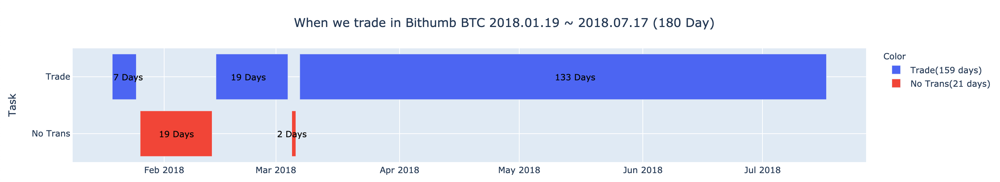

- Bithumb BTC Timeline

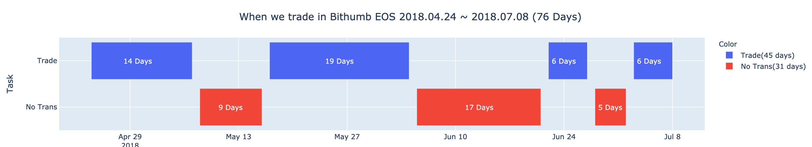

- Bithumb EOS Timeline

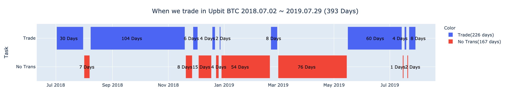

- Upbit BTC

# Bithumb - Bitcoin 2018 거래량 

# Bithumb 2018

Month|Jan|Feb|Mar|Apr|May|Jun|Jul|Aug
-|-|-|-|-|-|-|-|-
Total Trans|823|18,367|33,149|27,790|23,295|8,779|9,467|4,016
Profit(KRW)|-|20,057,445|8,951,034|23,967,448|11,999,306|4,513,842|494,149|-
Sell(KRW)|10,259,898|39,817,915,902|60,669,715,599|45,635,560,225|36,634,276,516|12,917,194,088|11,622,590,281|5,982,790,055
Buy(KRW)|7,375,346|39,797,858,457|60,657,579,097|45,609,884,185|36,622,277,210|12,912,680,246|11,622,096,132|5,966,645,458
Total Volume|17,635,244|76,615,774,359|121,327,294,696|91,245,444,410|73,256,553,726|25,829,874,334|23,244,686,413|11,979,435,513

 

## Bithumb-Bitcoin
Month|Jan|Feb|Mar|Apr|May|Jun|Jul|Aug
-|-|-|-|-|-|-|-|-
Total trans(BTC)|451.87K|518.51K|524.38K|377.09K|230.11K|123.44K|102.80K|238.13K
Total trans|5,173,911,500,000|6,129,825,220,000|4,028,287,160,000|3,816,150,800,000|1,903,469,920,000|869,387,920,000|897,958,000,000|1,874,083,100,000|
Young/Total|0.00034%|1.25%|3.01%|2.39%|3.85%|2.97%|2.59%|0.64%

## 그래프

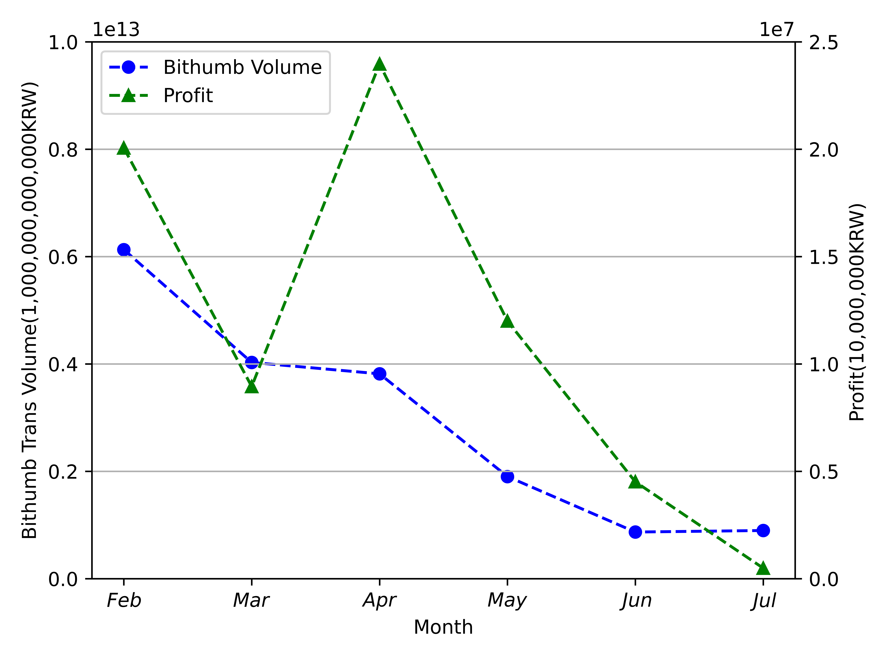

- 파랑색 : Bithumb 거래소 bitcoin 거래량(KRW)
- 초록색 : 수익(KRW)

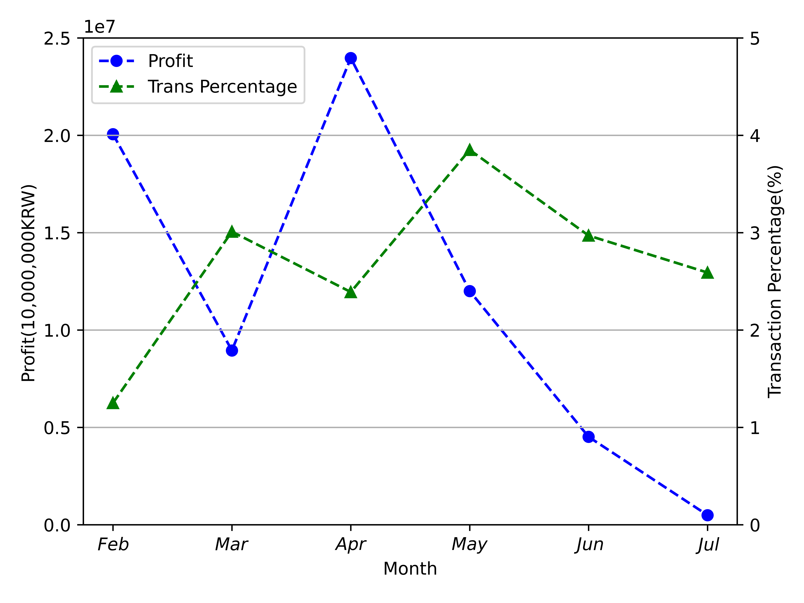

- 파랑색 : 수익(KRW)
- 초록색 : 교수님 거래량(KRW) / Bithumb 거래소 bitcoin 거래량(KRW)

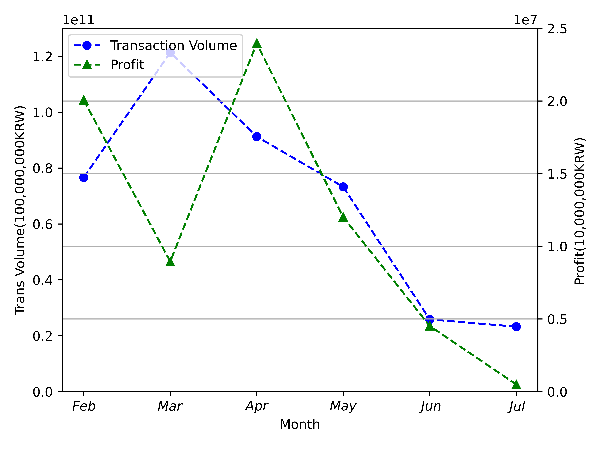

- 초록색 : 수익(KRW)
- 파랑색 : 교수님 거래량(KRW)

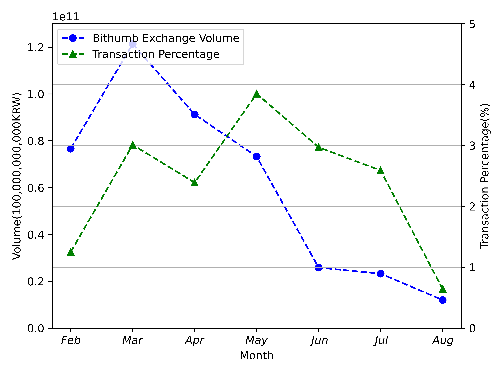

- 파랑색 : Bithumb 거래소 거래량(KRW)
- 초록색 : 교수님 거래량(KRW) / Bithumb 거래소 bitcoin 거래량(KRW)

# Upbit Bitcoin 2018s 거래량

출처 : 
https://kr.investing.com/crypto/bitcoin/btc-krw-historical-data?cid=1064952

## Upbit-Bitcoin 계정 거래량

Month|Jul|Aug|Sep|Oct|Nov|Dec|
-|-|-|-|-|-|-|-|-
Total Trans|"19,145"|"12,215"|"8,658"|"5,054"|"3,985"|"3,672"
Profit(KRW)|"400,090"|"2,958,947"|"1,673,592"|"10,510"|"5,164,420"|"-683,606"
Sell Volume(KRW)|"13,243,152,231"|"10,694,677,228"|"6,606,541,721"|"2,966,715,367"|"2,502,715,367"|"1,849,349,267"
Buy Volume(KRW)|"13,249,752,210"|"10,680,392,607"|"6,575,624,895"|"2,980,863,347"|"2,488,491,381"|"1,850,032,873"
Total Volume(KRW)|"26,492,904,441"|"21,375,069,835"|"13,182,166,616"|"5,947,578,714"|"4,991,206,748"|"3,699,382,140"

 

## Upbit-Bitcoin 거래소 거래량
Month|Jul|Aug|Sep|Oct|Nov|Dec|
-|-|-|-|-|-|-|-|-
Total trans(BTC)|"258,193"|"150,040"|"99,150"|"72,193"|"202,720"|"256,130"
Average(KRW)|"8,015,903"|"7,658,355"|"7,464,400"|"7,323,839"|"6,154,700"|"4,148,516"
Closing price(KRW)|"8,807,000"|"7,872,000"|"7,393,000"|"7,162,000"|"4,567,000"|"4,201,000"
Total trans(KRW)|"2,069,650,043,279"|"1,149,059,584,200"|"740,095,260,000"|"528,729,908,927"|"1,247,680,784,000"|"1,062,559,403,080"
Young/Total|1.280066866|1.860222927|1.781144581|1.124880324|0.400038761|0.348157678

- Total trans는 Total trans(BTC) *  월별 평균 가격으로 계산.

## 그래프

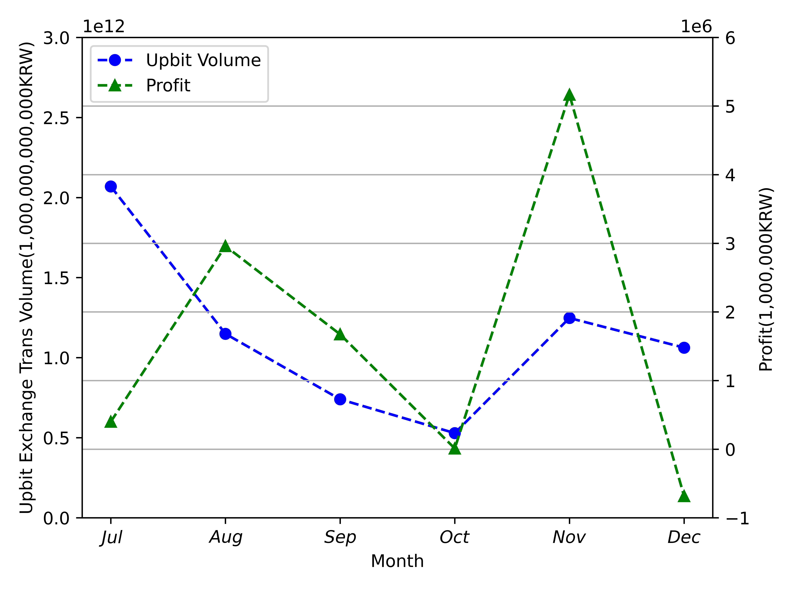

- 파랑색 : Upbit 거래소 bitcoin 거래량(KRW)
- 초록색 : 수익(KRW)

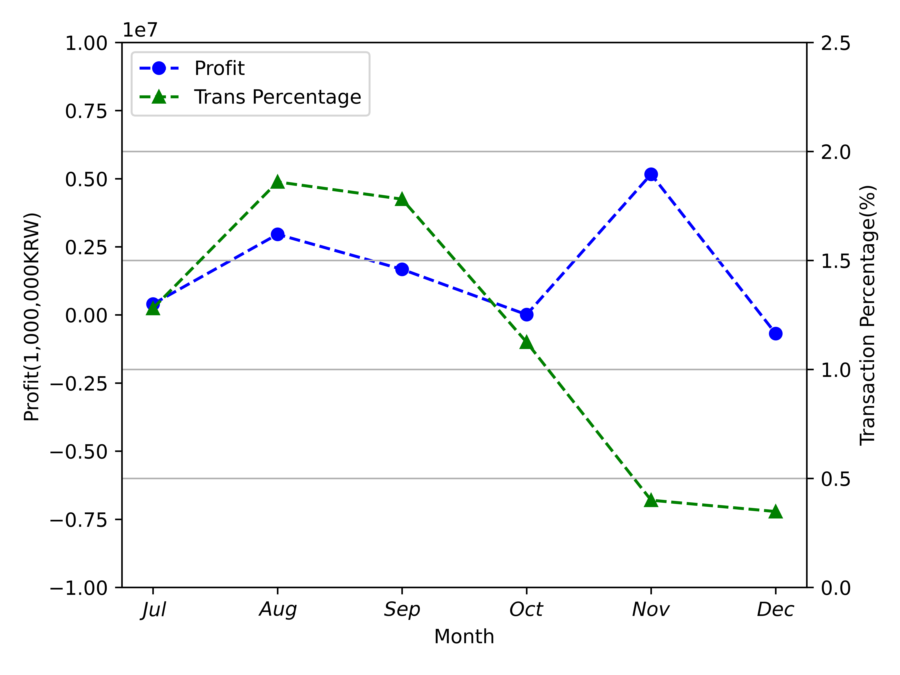

- 파랑색 : 수익(KRW)
- 초록색 : 교수님 거래량(KRW) / Upbit 거래소 bitcoin 거래량(KRW)

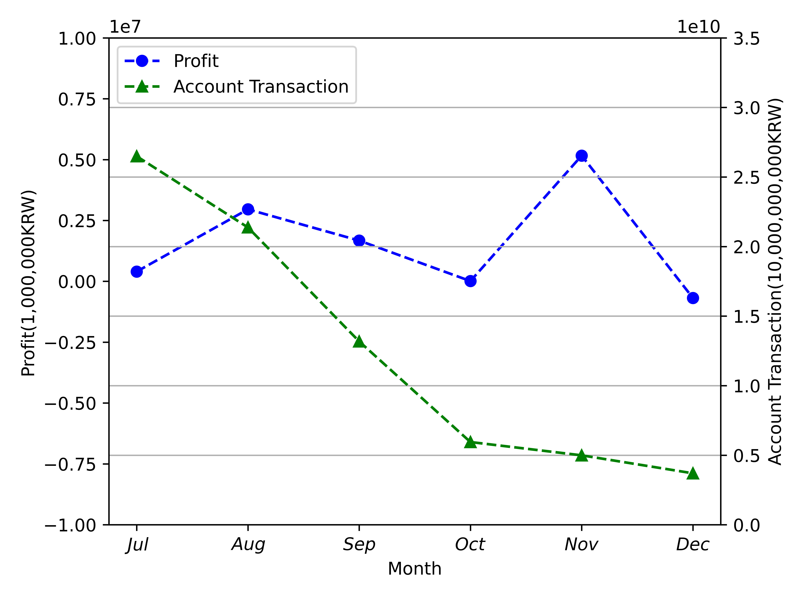

- 초록색 : 수익(KRW)
- 파랑색 : 교수님 거래량(KRW)

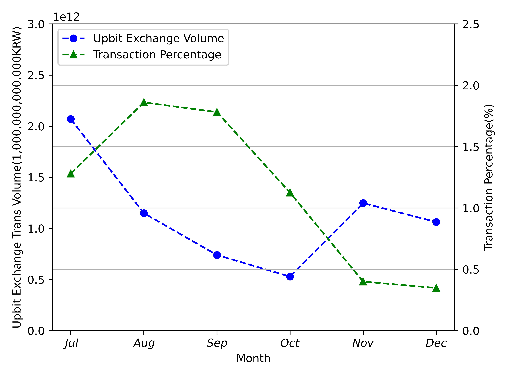

- 파랑색 : Upbit 거래소 거래량(KRW)
- 초록색 : 교수님 거래량(KRW) / Bithumb 거래소 bitcoin 거래량(KRW)

# Upbit Bitcoin 2019 거래량

출처 : 
https://kr.investing.com/crypto/bitcoin/btc-krw-historical-data?cid=1064952

## Upbit-Bitcoin 계정 거래량

Month|Feb|May|Jun|Jul
-|-|-|-|-|-|-|-|-
Total Trans|"4,579"|"17,622"|"37,907"|"19,652"
Profit(KRW)|"-135,473"|"1,728,400"|"1,513,153"|"-2,666,093"
Sell Volume(KRW)|"2,415,870,049"|"16,416,783,692"|"32,973,943,190"|"25,367,995,572"
Buy Volume(KRW)|"2,416,005,522"|"16,415,055,292"|"32,879,246,140"|"25,364,586,093"
Total Volume(KRW)|"4,831,875,571"|"32,831,838,984"|"65,853,189,330"|"50,732,581,665"

 

## Upbit-Bitcoin 거래소 거래량

Month|Feb|May|Jun|Jul|
-|-|-|-|-|-|-|-|-
Total trans(BTC)|"149,410"|"364,280"|"395,380"|"487,020"
Average(KRW)|"4,066,071"|"8,654,355"|"11,357,900"|"12,781,129"
Closing price(KRW)|"4,241,000"|"10,372,000"|"13,566,000"|"11,949,000"
Total trans(KRW)|"607,511,668,110"|"3,152,608,439,400"|"4,490,686,502,000"|"6,224,665,445,580"
Young/Total|0.795355188|1.041418229|1.466439247|0.815025034

- Total trans는 Total trans(BTC) *  월별 평균 가격으로 계산.

 

## 그래프

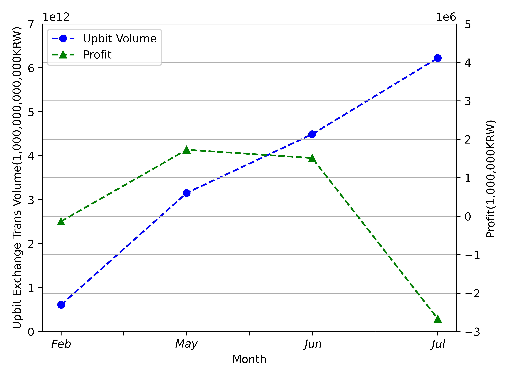

- 파랑색 : Upbit 거래소 bitcoin 거래량(KRW)
- 초록색 : 수익(KRW)

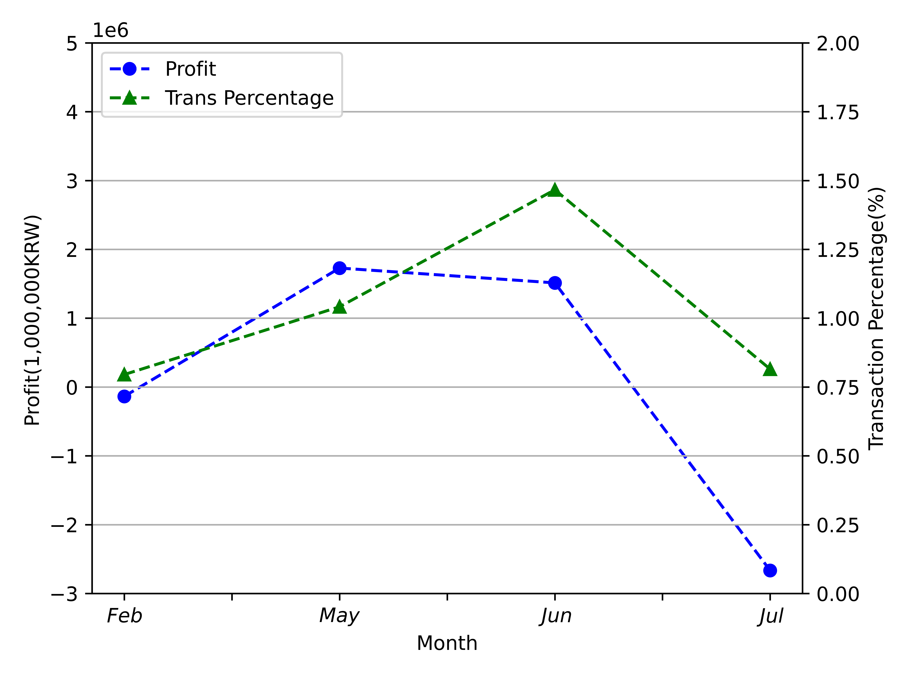

- 파랑색 : 수익(KRW)
- 초록색 : 교수님 거래량(KRW) / Upbit 거래소 bitcoin 거래량(KRW)

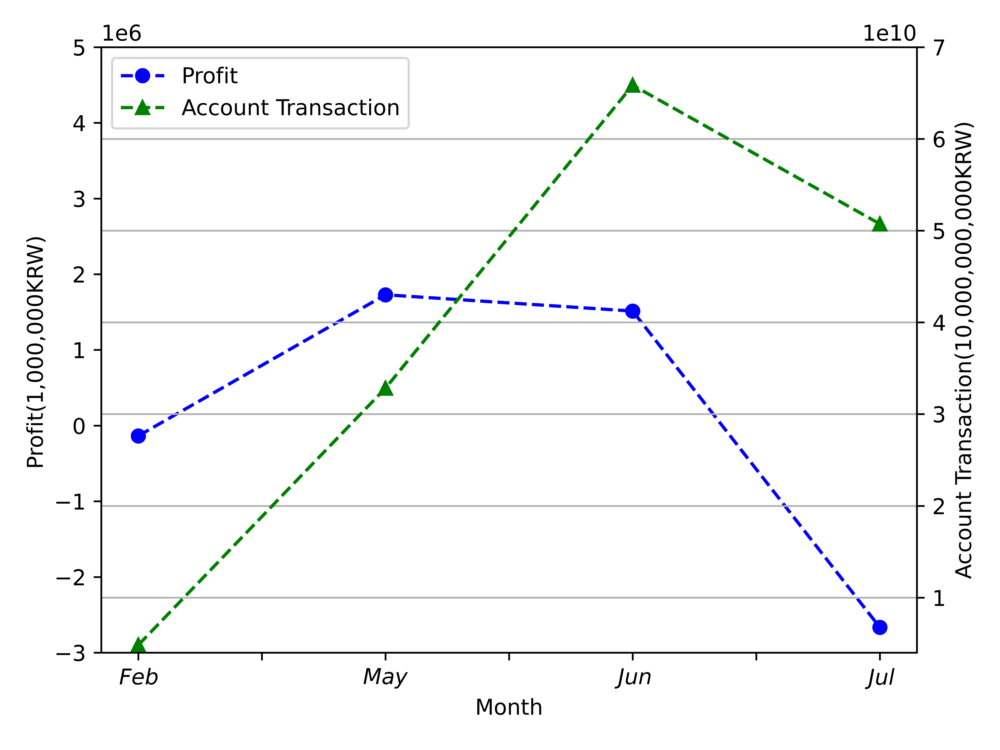

- 초록색 : 수익(KRW)
- 파랑색 : 교수님 거래량(KRW)

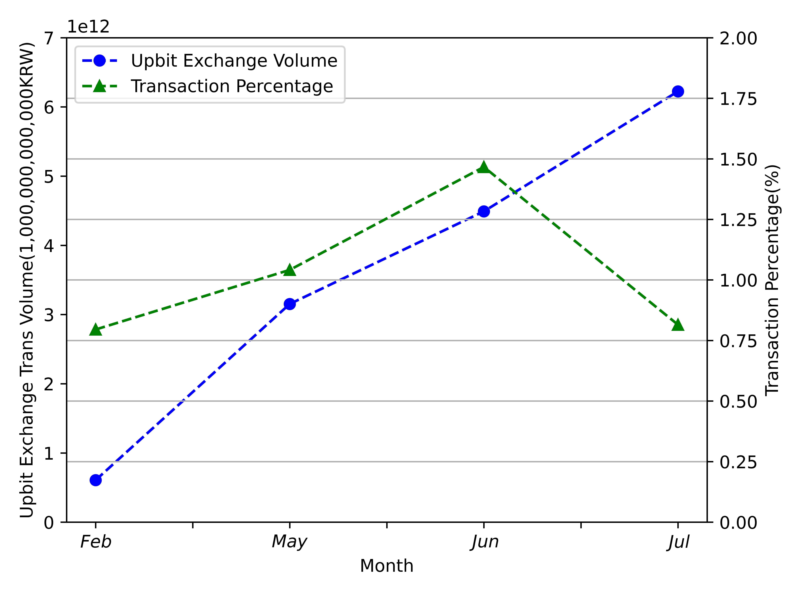

- 파랑색 : Upbit 거래소 거래량(KRW)
- 초록색 : 교수님 거래량(KRW) / Bithumb 거래소 bitcoin 거래량(KRW)

# Bithumb-BTC 2018 일 별 Buy, Sell, Total 거래

## 산것, 판것 거래량 예시 (매일 buy 양이 더 많음을 보여줄 수 있는)

## 각 달별 하루 sell, buy transaction
.png)
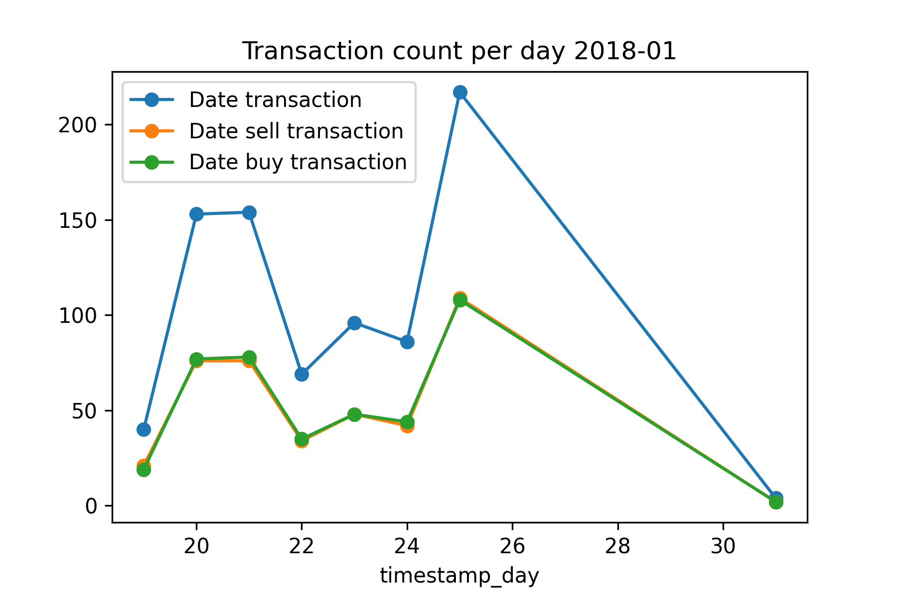
.png)
 
 
> 이런식으로 세가지 그래프를 그려보았으나 bar 그래프가 bar그래프가 제일 보기 좋아 보여 bar 그래프만 첨부합니다.

.png)
 
 

.png)
 
 

.png)
 
 

.png)
 
 

.png)

> 보통 한 번에 큰 양을 buy하여 작은 금액으로 여러번 sell 하기 때문에 sell의 transaction 수가 buy의 transaction 수보다 많은 경향을 띱니다.

 
  
  
 

# 

# 각 달 별 하루 sell, buy, volume

.png)
 
 

.png)
 
 

.png)
 
 

.png)
 
 

.png)
 
 

.png)
 
 

.png)

 

# Monthly Profit, Transaction (Bithumb)

Date | Feb | Mar | Apr | May | Jun | Jul 
-|-|-|-|-|-|-
Profit(KRW) | 20,057,445 | 3,562,946 | 23,967,448 | 11,999,306 | 4,513,842 | 494,149Buy Cnt | 10,757 | 20,453 | 16,238 | 14,868 | 5,587 | 5,247 
Sell Cnt | 7,610 | 12,696 | 11,552 | 8,427 | 3,192 | 4,220 
Buy (KRW) | 39,797,858,457 | 60,657,579,097 | 45,609,884,185 | 36,622,277,210 | 12,912,680,246 | 11,622,096,132 
Sell (KRW) | 39,817,915,902 | 60,669,715,599 | 45,635,560,225 | 	36,634,276,516 | 12,917,194,088 | 11,622,590,281 

 

## Bithumb February Profit Graph

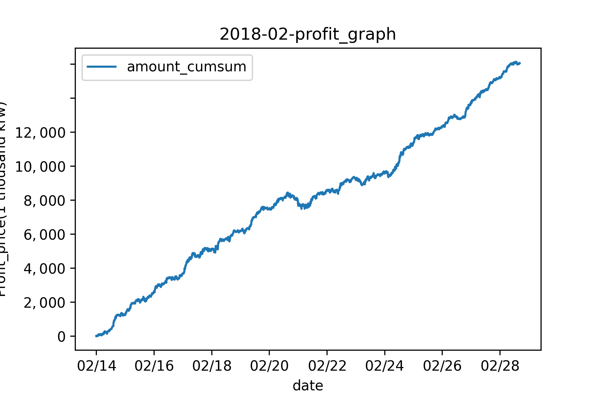

 

## Bithumb March Profit Graph

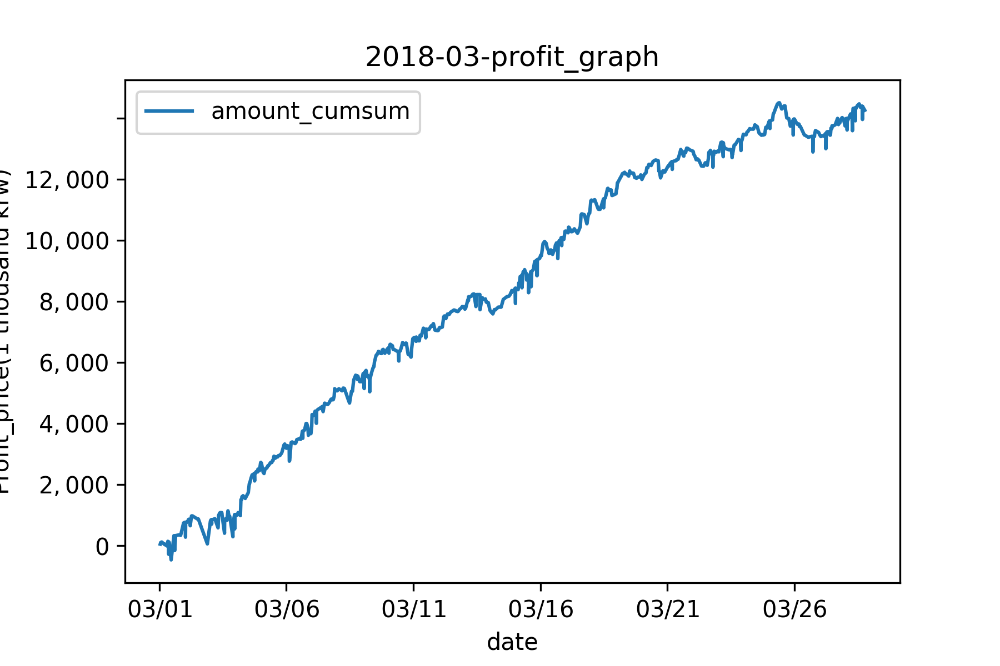

 

## Bithumb April Profit Graph

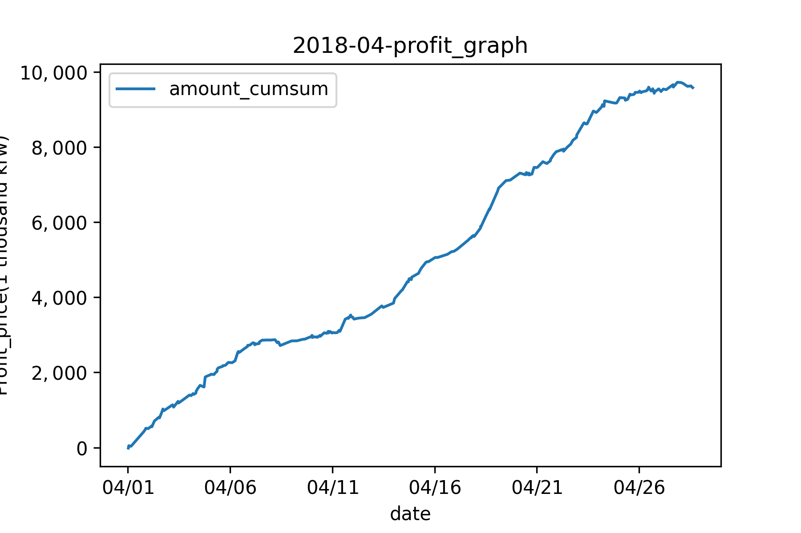

 

## Bithumb May Profit Graph

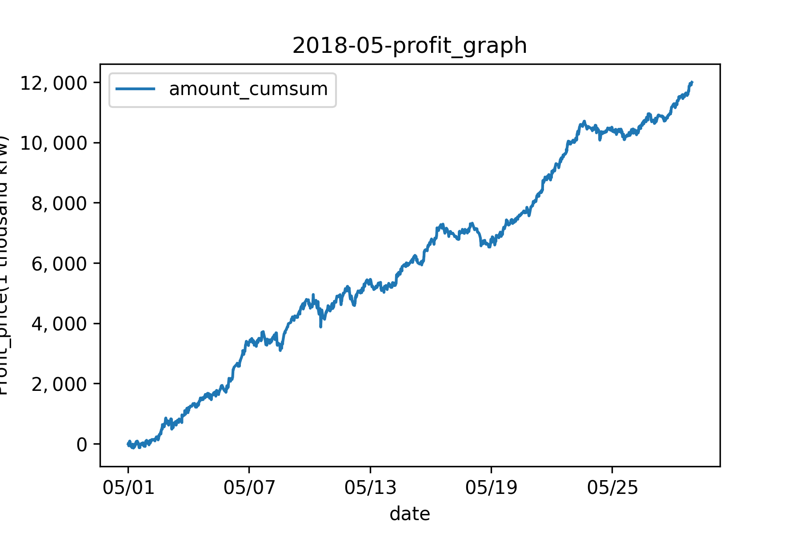

 

## Bithumb June Profit Graph

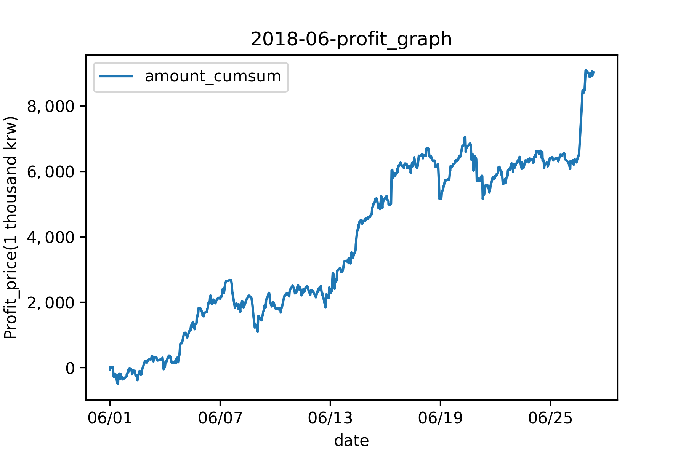

 

## Bithumb July Profit Graph

 

# Profit Point extraction

- Number of points to calculate the profit according to different standard for the total amount having
-  0.01 means holding less than 100,000krw (Assume 1 bitcoin values 10,000,000krw)
-   0.01 means holding less than 10,000krw (Assume 1 bitcoin values 10,000,000krw)
-    0.01 means holding less than 1,000krw (Assume 1 bitcoin values 10,000,000krw

Owned | Jan | Feb | Mar | Apr | May | Jan | Jul
-|-|-|-|-|-|-|-
0.01 | 0 | 3159 | 835 | 266 | 2939 | 1248 | 941 
0.001 | 0 | 2880 | 781 | 0 | 2438 | 1059 | 789 
0.0001 | 0 | 2830 | 773 | 0 | 2358 | 1028 | 771 

 

# Zero to Zero Time interval

- Hour:Minnute:Second
- By 0.01

Month | Min | Max | Mean
-|-|-|-
Feb | 00:00:41 | 03:34:21 | 00:06:50
Mar | 00:04:49 | 05:56:51 | 00:08:34
Apr | 00:13:35 | 25:45:34 | 02:41:38
May | 00:15:09 | 06:35:41 | 00:27:32
Jun | 00:00:52 | 12:49:00 | 00:34:31
Jul | 00:16:18 | 08:22:35 | 00:24:22

 

## February time interval graph

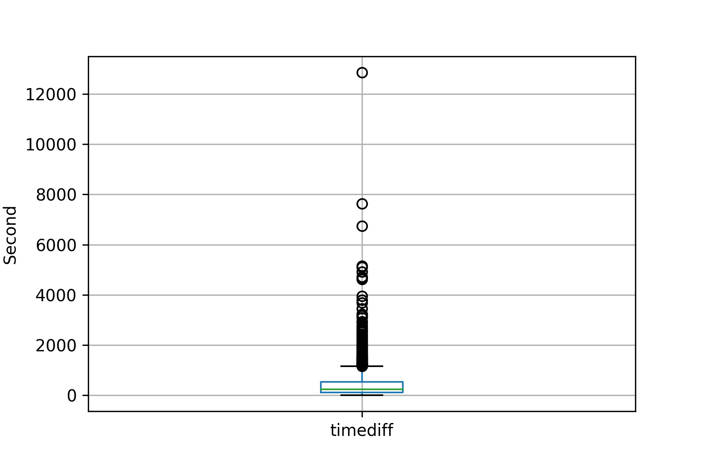

 

# February time interval - profit graph.

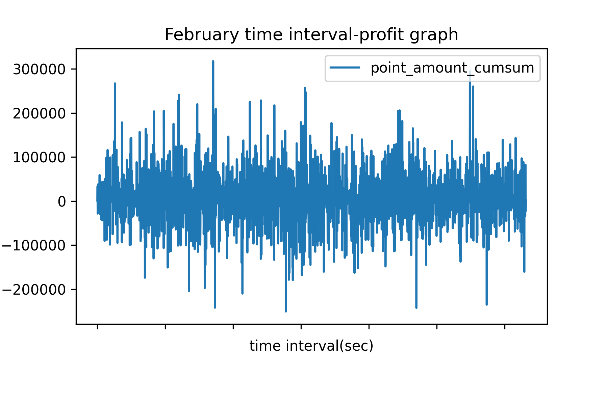

- 다른 달도 있지만 큰 의미 없는것 같아 생략하겠습니다. 필요하시면 말씀해 주세요!

 

# Summary By Month (Bithumb 2018)

Date | Jan | Feb | Mar | Apr | May | Jun | Jul | Aug 
-|-|-|-|-|-|-|-|-
Total trans | 823 | 18367 | 33149 | 27790 | 23295 | 8779 | 9467 | 4016 
Profit(KRW) | - | 20,057,445 | 8,951,034 | 23,967,448 | 11,999,306 | 4,513,842 | 494,149 | - 
Point cumsum profit | - | 2,385 | -31,333 | -89,836 | 8,336 | 56 | 27 | -
Sell (KRW)| 10,259,898 | 39,817,915,902 | 60,669,715,599 | 45,635,560,225 | 36,634,276,516 | 12,917,194,088 | 11,622,590,281 | 59,82,790,055 
Buy (KRW)| 7,375,346 | 39,797,858,457 | 60,657,579,097 | 45,609,884,185 | 36,622,277,210 | 12,912,680,246 | 11,622,096,132 | 5,966,645,458

 

# Summary By Month (Upbit 2018)
Date | Aug | Sep | Oct | Nov | Dec
-|-|-|-|-|-
Total trans | 12,215 | 8,658 | 5,054 | 3,985 | 3,672
profit (KRW)| 2,958,947 | 1,673,592 | 10,510 | 5,164,420 | -683,606
Point cumsum profit | 89,066 | 2,230 | -175 | 34,094 | -80,240
Sell (KRW)| 10,694,677,228 | 6,606,541,721 | 2,966,715,367 | 2,502,762,133 | 1,849,349,267
Buy (KRW) | 10,680,392,607 | 6,575,624,895 | 2,980,863,347 | 2,488,491,381 | 1,850,032,873

 

# Summary By Month (EOS 2018)
Date | Apr | May | Jun | Jul 
-|-|-|-|-
Total trans | 17,802 | 21,716 | 4,016 | 693 
Profit(KRW) | 26,531,231 | 26,790,133 | - | 283,770
Point cumsum profit | 458 | -21,226 | - | 12,058
Sell (KRW)| 31,134,212,201 | 36779974440 | 5,982,790,055 | 600,733,901
Buy (KRW) | 31,127,884,338 | 36,755,751,094 | 5,966,645,458 | 600,450,131

 

# Summary By Month (Upbit 2019)
Date | Feb | May | June | July
-|-|-|-|-
Total trans | 4,579 | 17,622 | 37,907 | 19,652
Profit(KRW) | -135,473 | 1,728,400 | 1,513,153 | -2,666,093
Point cumsum profit | -60,390 | 56,242 | -21,272 | -185,752
Sell (KRW)| 2,415,870,049 | 16,416,783,692 | 32,873,943,190 | 25,367,995,572
Buy (KRW) | 2,416,005,522 | 16,415,055,292 | 32,879,246,140 | 25,364,586,093

 

# 각 달 별 요약 테이블
> num of trans. : 트랜잭션 개수  
> num of buy trans.	: 사는 트랜잭션 개수  
> num of sell trans. : 파는 트랜잭션 개수  
> cumsum_profit	: 누적 이윤  
> point_cumsum_profit : 구간별 이윤 (0이 되는 시점 사이)	  
> positive amount : 번 금액(원화)  
> negative amount : 잃은 금액(원화)  
> coin of 1 tras. : 1트랜잭션 당 평균 코인 개수  
> coin of 1 buy trans. : 사는 1트랜잭션 당 평균 코인 개수  
> coin of 1 sell tras. : 파는 1트랜잭션 당 평균 코인 개수  

## bithumb btc 2018.01 ~2018.07 요약 테이블
-|2018-01|2018-02|2018-03|2018-04|2018-05|2018-06|2018-07
-|-|-|-|-|-|-|-|-
num of trans.|823.0|18367.0|33149.0|27790.0|23295.0|8779.0|9467.0
num of buy trans.|409.0|10757.0|20453.0|16238.0|14868.0|5587.0|5247.0
num of sell trans.|414.0|7610.0|12696.0|11552.0|8427.0|3192.0|4220.0
cumsum_profit||20057445.0|3562946.0|23967448.0|11999306.0|4513842.0|463063.0
point_cumsum_profit||2385.0|-31333.0|-89836.0|86556.0|56.0|87341.0
positive amount|10259898.0|39817915902.0|60669715599.0|45635560225.0|36634276516.0|12917194088.0|11622590281.0
negative amount|-7375346.0|-39797858457.0|-60657579097.0|-45609884185.0|-36622277210.0|-12912680246.0|-11622096132.0
coin of 1 tras.|0.00136328227217497|0.36250535148636137|0.37065456331201546|0.3851542489899244|0.3291892953719682|0.39093720788244674|0.3375046865649097
coin of 1 buy trans.|0.0015694827139364305|0.30947920936599427|0.3003234156896299|0.32958421968530605|0.2578848746993543|0.30714495223196703|0.30437934747665335
coin of 1 sell tras.|-0.0011595721739130432|-0.4374596498817346|-0.48395662398629485|-0.463265929724723|-0.45499374850599267|-0.5375999059774436|-0.37869157144549764

 
 

## bithumb eos 2018.01 ~2018.07 요약 테이블
-|2018-04|2018-05|2018-06|2018-07
-|-|-|-|-|-|-|-|-
num of trans.|17802.0|21716.0|4016.0|693.0
num of buy trans.|9859.0|12457.0|2298.0|410.0
num of sell trans.|7943.0|9259.0|1718.0|283.0
cumsum_profit|26531231.0|26790133.0||283770.0
point_cumsum_profit|458.0|-21226.0||12058.0
positive amount|31134212201.0|36779974440.0|5982790055.0|600733901.0
negative amount|-31127884338.0|-36755751094.0|-5966645458.0|-600450131.0
coin of 1 tras.|184.68292993396418|195.54757809860467|210.3672099355204|177.17513437685426
coin of 1 buy trans.|166.6865564018795|170.439419884184|184.07707014768062|149.7345952864878
coin of 1 sell tras.|-207.0203649903437|-229.3279352513252|-245.53294988456344|-216.92997899540634

 
 

## upbit btc 2018.07 ~2018.12 요약 테이블
-|2018-07|2018-08|2018-09|2018-10|2018-11|2018-12
-|-|-|-|-|-|-|-|-
num of trans.|19145.0|12215.0|8658.0|5054.0|3985.0|3672.0
num of buy trans.|11598.0|7745.0|4774.0|2759.0|2357.0|2081.0
num of sell trans.|7535.0|4461.0|3876.0|2294.0|1628.0|1589.0
cumsum_profit|400090.0|2958947.0|1673592.0|10510.0|5164420.0|-683606.0
point_cumsum_profit|6045.0|89066.0|2230.0|-175.0|34094.0|-80240.0
positive amount|13243152231.0|10694677228.0|6606541721.0|2966715367.0|2502762133.0|1849349267.0
negative amount|-13249752210.0|-10680392607.0|-6575624895.0|-2980863347.0|-2488491381.0|-1850032873.0
coin of 1 tras.|0.16271326027787936|0.23469482569381908|0.20259829090321088|0.15975957289275822|0.20465262590213298|0.22620501566721132
coin of 1 buy trans.|0.13426256674943957|0.1851311574306004|0.18413238545454544|0.14596319028271112|0.1734282433983878|0.1995734685583854
coin of 1 sell tras.|-0.2067641829754479|-0.32121866878278416|-0.22576057644994837|-0.17642216190061027|-0.24985893398648648|-0.2613671675707992

 
 

## upbit btc 2019.02 요약 테이블
-|2019-02
-|-|-|-|-|-|-|-|-
num of trans.|4579.0
num of buy trans.|2604.0
num of sell trans.|1972.0
cumsum_profit|-135473.0
point_cumsum_profit|-60390.0
positive amount|2415870049.0
negative amount|-2416005522.0
coin of 1 tras.|0.24641927307927497
coin of 1 buy trans.|0.21665781338325651
coin of 1 sell tras.|-0.2860937653194726

 
 

## upbit btc 2019.05 ~2019.07 요약 테이블
-|2019-05|2019-06|2019-07
-|-|-|-|-|-|-|-|-
num of trans.|17622.0|37907.0|19652.0
num of buy trans.|10331.0|21414.0|11705.0
num of sell trans.|7276.0|16485.0|7945.0
cumsum_profit|1728400.0|1513153.0|-2666093.0
point_cumsum_profit|56242.0|-21272.0|-185752.0
positive amount|16416783692.0|32873943190.0|25367995572.0
negative amount|-16415055292.0|-32879246140.0|-25364586093.0
coin of 1 tras.|0.19526902352286915|0.13933743088849024|0.19451098149704865
coin of 1 buy trans.|0.1665390896253993|0.12331593064583918|0.16330709716445962
coin of 1 sell tras.|-0.23646445811434855|-0.16021696413284808|-0.24053118137444934

 
 

# 분, 시간, 일 당 transaction 개수 테이블

## bithumb-2018-01-btc-TransactionTypeCounterPerMinuteHourDay
-|B_min|B_max|B_avg|S_min|S_max|S_avg|T_min|T_max|T_avg
-|-|-|-|-|-|-|-|-|-
minute|1|2|1.0072992700729928|1|2|1.0049140049140048|1|3|1.0564826700898589
hour|1|14|3.312|1|12|3.3252032520325203|1|26|6.0962962962962965
date|1|108|37.63636363636363|1|109|45.44444444444444|1|217|68.58333333333333

 
 

## bithumb-2018-02-btc-TransactionTypeCounterPerMinuteHourDay
-|B_min|B_max|B_avg|S_min|S_max|S_avg|T_min|T_max|T_avg
-|-|-|-|-|-|-|-|-|-
minute|1|20|1.6979027219991076|1|14|1.8750217883911453|1|21|2.1767006399620765
hour|1|76|21.316526610644253|1|118|30.047486033519554|1|193|51.30446927374302
date|263|919|507.3333333333333|357|1293|717.1333333333333|688|2212|1224.4666666666667
 
 

## bithumb-2018-03-btc-TransactionTypeCounterPerMinuteHourDay
-|B_min|B_max|B_avg|S_min|S_max|S_avg|T_min|T_max|T_avg
-|-|-|-|-|-|-|-|-|-
minute|1|28|1.7101293103448276|1|26|2.1219006120966903|1|29|2.231354334948842
hour|1|61|18.58857979502196|1|96|29.94582723279649|4|131|48.53440702781845
date|244|636|437.7931034482759|350|1179|705.2758620689655|613|1782|1143.0689655172414
 
 

## bithumb-2018-04-btc-TransactionTypeCounterPerMinuteHourDay
-|B_min|B_max|B_avg|S_min|S_max|S_avg|T_min|T_max|T_avg
-|-|-|-|-|-|-|-|-|-
minute|1|40|1.8620245003223728|1|24|2.1346128565794658|1|40|2.3081395348837206
hour|1|117|16.385815602836875|1|121|22.93502824858757|2|208|39.196050775740474
date|202|745|385.06666666666666|336|931|541.2666666666667|538|1600|926.3333333333334
 
 

## bithumb-2018-05-btc-TransactionTypeCounterPerMinuteHourDay
-|B_min|B_max|B_avg|S_min|S_max|S_avg|T_min|T_max|T_avg
-|-|-|-|-|-|-|-|-|-
minute|1|44|1.7148962148962148|1|32|2.017915309446254|1|44|2.099026851684988
hour|1|73|11.802521008403364|1|129|20.535911602209946|1|198|31.954732510288068
date|1|544|263.34375|138|950|479.61290322580646|1|1494|727.96875
 
 

## bithumb-2018-06-btc-TransactionTypeCounterPerMinuteHourDay
-|B_min|B_max|B_avg|S_min|S_max|S_avg|T_min|T_max|T_avg
-|-|-|-|-|-|-|-|-|-
minute|1|18|1.4436906377204886|1|15|1.6971445929526123|1|19|1.6970809974869514
hour|1|42|5.5706806282722505|1|70|9.040453074433655|1|101|13.91283676703645
date|47|248|106.4|87|373|186.23333333333332|142|563|292.6333333333333

 
 

## bithumb-2018-07-btc-TransactionTypeCounterPerMinuteHourDay
-|B_min|B_max|B_avg|S_min|S_max|S_avg|T_min|T_max|T_avg
-|-|-|-|-|-|-|-|-|-
minute|1|28|1.829215431296056|1|27|1.9003984063745016|1|30|2.0706474190726163
hour|1|71|12.411764705882351|1|91|14.73876404494382|1|135|25.936986301369863
date|1|381|248.23529411764707|2|467|308.6470588235294|3|812|556.8823529411765
 
 
 
 

## bithumb-2018-04-eos-TransactionTypeCounterPerMinuteHourDay
-|B_min|B_max|B_avg|S_min|S_max|S_avg|T_min|T_max|T_avg
-|-|-|-|-|-|-|-|-|-
minute|1|35|2.371044776119404|1|39|2.574151436031332|1|39|3.3374578177727785
hour|6|161|51.577922077922075|3|186|64.01948051948052|9|347|115.59740259740259
date|332|1753|1134.7142857142858|444|2043|1408.4285714285713|776|3796|2543.1428571428573

 
 

## bithumb-2018-05-eos-TransactionTypeCounterPerMinuteHourDay

-|B_min|B_max|B_avg|S_min|S_max|S_avg|T_min|T_max|T_avg
-|-|-|-|-|-|-|-|-|-
minute|1|32|2.173474178403756|1|50|2.430634146341464|1|50|2.742265437555247
hour|1|103|19.57505285412262|1|111|26.225263157894734|1|195|45.526205450733755
date|67|1115|420.8636363636364|91|1464|566.2272727272727|173|2518|987.0909090909091

 
 

## bithumb-2018-06-eos-TransactionTypeCounterPerMinuteHourDay
-|B_min|B_max|B_avg|S_min|S_max|S_avg|T_min|T_max|T_avg
-|-|-|-|-|-|-|-|-|-
minute|1|26|2.0698795180722893|1|13|2.1179723502304157|1|26|2.347165400350672
hour|1|62|10.16568047337278|1|78|12.766666666666667|1|139|21.70810810810811
date|3|692|171.8|6|870|229.8|9|1562|401.6

 
 

## bithumb-2018-07-eos-TransactionTypeCounterPerMinuteHourDay
-|B_min|B_max|B_avg|S_min|S_max|S_avg|T_min|T_max|T_avg
-|-|-|-|-|-|-|-|-|-
minute|1|7|1.4663212435233162|1|13|1.6666666666666667|1|13|1.65
hour|1|11|3.0760869565217392|1|16|4.183673469387755|1|25|6.537735849056604
date|32|65|47.166666666666664|45|109|68.33333333333333|77|168|115.5

 
 
 
 

## upbit-2018-07-btc-TransactionTypeCounterPerMinuteHourDay
-|B_min|B_max|B_avg|S_min|S_max|S_avg|T_min|T_max|T_avg
-|-|-|-|-|-|-|-|-|-
minute|1|36|2.114790906539433|1|44|2.660091743119266|1|44|2.647994467496542
hour|1|92|12.558333333333335|1|139|18.82792207792208|1|176|30.583067092651763
date|3|699|251.16666666666666|2|941|386.6|5|1640|638.1666666666666
 
 

## upbit-2018-08-btc-TransactionTypeCounterPerMinuteHourDay
-|B_min|B_max|B_avg|S_min|S_max|S_avg|T_min|T_max|T_avg
-|-|-|-|-|-|-|-|-|-
minute|1|24|2.427094668117519|1|50|3.3528138528138527|1|50|3.1105169340463457
hour|1|80|9.761487964989056|1|146|15.459081836327345|1|202|23.22243346007605
date|42|522|185.875|87|984|322.7083333333333|129|1492|508.9583333333333
 
 

## upbit-2018-09-btc-TransactionTypeCounterPerMinuteHourDay
-|B_min|B_max|B_avg|S_min|S_max|S_avg|T_min|T_max|T_avg
-|-|-|-|-|-|-|-|-|-
minute|1|38|2.160535117056856|1|63|2.458290422245108|1|63|2.4395604395604398
hour|1|58|7.313207547169812|1|123|8.648550724637682|1|142|14.009708737864075
date|47|377|129.2|54|320|159.13333333333333|106|675|288.6
 
 

## upbit-2018-10-btc-TransactionTypeCounterPerMinuteHourDay
-|B_min|B_max|B_avg|S_min|S_max|S_avg|T_min|T_max|T_avg
-|-|-|-|-|-|-|-|-|-
minute|1|18|2.0911577028258894|1|60|2.605288007554297|1|60|2.4750244857982366
hour|1|108|5.792929292929293|1|92|6.680387409200969|1|200|10.128256513026052
date|2|373|74.0|2|430|89.0|18|803|163.03225806451613
 
 

## upbit-2018-11-btc-TransactionTypeCounterPerMinuteHourDay
-|B_min|B_max|B_avg|S_min|S_max|S_avg|T_min|T_max|T_avg
-|-|-|-|-|-|-|-|-|-
minute|1|15|1.99265605875153|1|45|2.663276836158192|1|45|2.479775980087118
hour|1|85|6.434782608695652|1|90|8.602189781021897|1|175|12.186544342507643
date|6|385|74.0|13|572|107.13636363636364|21|957|181.13636363636363
 
 

## upbit-2018-12-btc-TransactionTypeCounterPerMinuteHourDay
-|B_min|B_max|B_avg|S_min|S_max|S_avg|T_min|T_max|T_avg
-|-|-|-|-|-|-|-|-|-
minute|1|59|2.429663608562691|1|53|2.6045056320400497|1|59|2.848719937936385
hour|1|108|13.024590163934429|1|114|17.198347107438018|1|206|29.142857142857146
date|41|685|198.625|57|721|260.125|125|1406|459.0
 
 

## upbit-2019-02-btc-TransactionTypeCounterPerMinuteHourDay
-|B_min|B_max|B_avg|S_min|S_max|S_avg|T_min|T_max|T_avg
-|-|-|-|-|-|-|-|-|-
minute|1|161|5.005076142131982|1|196|4.126782884310618|1|196|4.730371900826446
hour|1|162|14.085714285714285|1|201|18.08333333333333|1|242|30.93918918918919
date|28|687|246.5|38|523|325.5|66|1006|572.375
 
 

## upbit-2019-05-btc-TransactionTypeCounterPerMinuteHourDay
-|B_min|B_max|B_avg|S_min|S_max|S_avg|T_min|T_max|T_avg
-|-|-|-|-|-|-|-|-|-
minute|1|160|2.985638079606073|1|173|3.5834200485605274|1|173|3.6590531561461783
hour|1|199|21.915662650602414|1|199|31.024024024024023|1|317|52.136094674556205
date|104|1156|454.75|223|1795|645.6875|327|2954|1101.375
 
 

## upbit-2019-06-btc-TransactionTypeCounterPerMinuteHourDay
-|B_min|B_max|B_avg|S_min|S_max|S_avg|T_min|T_max|T_avg
-|-|-|-|-|-|-|-|-|-
minute|1|155|3.8115606936416175|1|455|4.51676861421641|1|456|4.802609907512986
hour|1|350|27.429284525790354|1|749|34.538709677419355|1|914|58.408320493066256
date|76|2582|549.5|151|3228|713.8|229|5654|1263.5666666666666
 
 

## upbit-2019-07-btc-TransactionTypeCounterPerMinuteHourDay
-|B_min|B_max|B_avg|S_min|S_max|S_avg|T_min|T_max|T_avg
-|-|-|-|-|-|-|-|-|-
minute|1|199|2.9404145077720205|1|26|3.336659064994299|1|199|3.483779471724872
hour|1|199|17.38512035010941|1|149|24.38541666666667|1|211|39.781376518218615
date|1|715|294.25925925925924|4|1740|450.1923076923077|1|2283|727.8518518518518
 
 
 
 

# 일별 transaction 개수 그래프

## bithumb-2018-01-btc-transaction_counter

## bithumb-2018-02-btc-transaction_counter

## bithumb-2018-03-btc-transaction_counter

## bithumb-2018-04-btc-transaction_counter

## bithumb-2018-05-btc-transaction_counter

## bithumb-2018-06-btc-transaction_counter

## bithumb-2018-07-btc-transaction_counter

## bithumb-2018-04-eos-transaction_counter

## bithumb-2018-05-eos-transaction_counter

## bithumb-2018-06-eos-transaction_counter

## bithumb-2018-07-eos-transaction_counter

## upbit-2018-07-btc-transaction_counter.png

## upbit-2018-08-btc-transaction_counter.png

## upbit-2018-09-btc-transaction_counter.png

## upbit-2018-10-btc-transaction_counter.png

## upbit-2018-11-btc-transaction_counter.png

## upbit-2018-12-btc-transaction_counter.png

## upbit-2019-02-btc-transaction_counter.png

## upbit-2019-05-btc-transaction_counter.png

## upbit-2019-06-btc-transaction_counter.png

## upbit-2019-07-btc-transaction_counter.png

 
 

# 달별 잔여 코인개수가 0이 되는 지점 간의 profit 차이 그래프
## bithumb-2018-02-btc-profit_point_graph

## bithumb-2018-03-btc-profit_point_graph

## bithumb-2018-04-btc-profit_point_graph

## bithumb-2018-05-btc-profit_point_graph

## bithumb-2018-06-btc-profit_point_graph

## bithumb-2018-07-btc-profit_point_graph

## bithumb-2018-04-eos-profit_point_graph

## bithumb-2018-05-eos-profit_point_graph

## bithumb-2018-07-eos-profit_point_graph

## upbit-2018-07-btc-profit_point_graph

## upbit-2018-08-btc-profit_point_graph

## upbit-2018-09-btc-profit_point_graph

## upbit-2018-10-btc-profit_point_graph

## upbit-2018-11-btc-profit_point_graph

## upbit-2018-12-btc-profit_point_graph

## upbit-2019-02-btc-profit_point_graph

## upbit-2019-05-btc-profit_point_graph

## upbit-2019-06-btc-profit_point_graph

## upbit-2019-07-btc-profit_point_graph

 
 
 

# 달별 잔여 코인개수가 0이 되는 지점의 누적 profit 그래프
## bithumb-2018-02-btc-profit_graph

## bithumb-2018-03-btc-profit_graph

## bithumb-2018-04-btc-profit_graph

## bithumb-2018-05-btc-profit_graph

## bithumb-2018-06-btc-profit_graph

## bithumb-2018-07-btc-profit_graph

## bithumb-2018-04-eos-profit_graph

## bithumb-2018-05-eos-profit_graph

## bithumb-2018-07-eos-profit_graph

## upbit-2018-07-btc-profit_graph

## upbit-2018-08-btc-profit_graph

## upbit-2018-09-btc-profit_graph

## upbit-2018-10-btc-profit_graph

## upbit-2018-11-btc-profit_graph

## upbit-2018-12-btc-profit_graph

## upbit-2019-02-btc-profit_graph

## upbit-2019-05-btc-profit_graph

## upbit-2019-06-btc-profit_graph

## upbit-2019-07-btc-profit_graph

# Bithumb-BTC 2018 January to 2018 August

timestamp|closing_Price|Trans(BTC)|bithumb_Transaction(KRW)|privateAccount|percentage
-|-|-|-|-|-
2018.7.31|8735000|2670|23322450000 |0|0
2018.7.30|9224000|1510|13928240000 |0|0
2018.7.29|9185000|940|8633900000 |0|0
2018.7.28|9195000|940|8643300000 |0|0
2018.7.27|9100000|2940|26754000000 |0|0
2018.7.26|8935000|2570|22962950000 |0|0
2018.7.25|9150000|2840|25986000000 |0|0
2018.7.24|9195000|6270|57652650000 |0|0
2018.7.23|8752000|3120|27306240000 |0|0
2018.7.22|8325000|1860|15484500000 |0|0
2018.7.21|8384000|1610|13498240000 |0|0
2018.7.20|8351000|3560|29729560000 |0|0
2018.7.19|8440000|2960|24982400000 |0|0
2018.7.18|8300000|4790|39757000000 |0|0
2018.7.17|8031000|4170|33489270000 |2533822|0.007566071
2018.7.16|7475000|4940|36926500000 |2407638973|6.520084419
2018.7.15|7192000|1320|9493440000 |1359579172|14.3212489
2018.7.14|7119000|1450|10322550000 |1091471433|10.5736609
2018.7.13|7075000|2290|16201750000 |1627665593|10.04623323
2018.7.12|7107000|2240|15919680000 |1549419756|9.732731789
2018.7.11|7236000|2690|19464840000 |1745363933|8.966752015
2018.7.10|7145000|3590|25650550000 |2215535773|8.637381159
2018.7.9|7486000|3350|25078100000 |2339370485|9.328340205
2018.7.8|7494000|4380|32823720000 |1425871853|4.344028809
2018.7.7|7544000|5300|39983200000 |1116354922|2.79205997
2018.7.6|7484000|5150|38542600000 |1057734742|2.744326387
2018.7.5|7281000|4230|30798630000 |941947326|3.058406578
2018.7.4|7261000|4660|33836260000 |1409221482|4.164826379
2018.7.3|7197000|6090|43829730000 |1755766966|4.005881318
2018.7.2|7253000|4910|35612230000 |866976970|2.434492224
2018.7.1|7074000|4830|34167420000 |332233212|0.972368449
2018.6.30|7143000|3370|24071910000 |388063913|1.612102708
2018.6.29|6951000|3430|23841930000 |506600605|2.124830519
2018.6.28|6650000|2760|18354000000 |404429014|2.203492503
2018.6.27|6923000|1750|12115250000 |503469656|4.155668732
2018.6.26|6872000|1830|12575760000 |806319570|6.41169655
2018.6.25|7037000|2600|18296200000 |781944756|4.273809622
2018.6.24|6985000|3570|24936450000 |665933064|2.67052072
2018.6.23|7014000|2350|16482900000 |975156383|5.916169988
2018.6.22|6909000|4610|31850490000 |1389869919|4.363731669
2018.6.21|7473000|1580|11807340000 |577768337|4.893298042
2018.6.20|7463000|5040|37613520000 |857754020|2.280440703
2018.6.19|7504000|4550|34143200000 |987655261|2.892685106
2018.6.18|7449000|3830|28529670000 |776179842|2.720605748
2018.6.17|7214000|1860|13418040000 |612433117|4.564251687
2018.6.16|7263000|2760|20045880000 |503122911|2.509856943
2018.6.15|7298000|5370|39190260000 |1337311449|3.412356665
2018.6.14|7355000|7530|55383150000 |1650388152|2.979946341
2018.6.13|7031000|6860|48232660000 |1412388105|2.928281594
2018.6.12|7349000|6820|50120180000 |1095018611|2.184785871
2018.6.11|7642000|6910|52806220000 |1196636584|2.266090214
2018.6.10|7583000|7950|60284850000 |999124585|1.657339423
2018.6.9|8238000|2690|22160220000 |625962025|2.824710337
2018.6.8|8337000|3630|30263310000 |779365340|2.575281223
2018.6.7|8365000|3700|30950500000 |1124527034|3.633308134
2018.6.6|8350000|3900|32565000000 |1003636235|3.081947597
2018.6.5|8349000|4180|34898820000 |857309460|2.456557156
2018.6.4|8252000|4580|37794160000 |638058166|1.688245396
2018.6.3|8420000|3880|32669600000 |650794236|1.992048375
2018.6.2|8329000|4340|36147860000 |928193266|2.567768233
2018.6.1|8278000|4510|37333780000 |794460718|2.12799432
2018.5.31|8272000|5960|49301120000 |563514765|1.143006011
2018.5.30|8199000|6850|56163150000 |580552058|1.033688563
2018.5.29|8303000|7340|60944020000 |524002315|0.85980924
2018.5.28|7888000|7090|55925920000 |431632616|0.771793501
2018.5.27|8173000|2980|24355540000 |237710205|0.976000553
2018.5.26|8164000|3660|29880240000 |261136899|0.873945119
2018.5.25|8320000|6000|49920000000 |681984676|1.3661552
2018.5.24|8403000|8650|72685950000 |1055529545|1.452178234
2018.5.23|8485000|9400|79759000000 |1147547739|1.438768965
2018.5.22|8951000|6000|53706000000 |833107084|1.551236517
2018.5.21|9331000|5220|48707820000 |954023745|1.958666483
2018.5.20|9373000|4770|44709210000 |789460214|1.765766414
2018.5.19|9100000|3930|35763000000 |889631353|2.487574736
2018.5.18|9169000|6500|59598500000 |1514323102|2.540874522
2018.5.17|9069000|6820|61850580000 |1546594426|2.500533424
2018.5.16|9303000|8850|82331550000 |2052901506|2.493456647
2018.5.15|9509000|8640|82157760000 |2460913560|2.995351334
2018.5.14|9790000|10160|99466400000 |2061334907|2.072393197
2018.5.13|9809000|6330|62090970000 |1876379212|3.021984053
2018.5.12|9491000|9730|92347430000 |1844350809|1.997186937
2018.5.11|9251000|13040|120633000000 |1748230958|1.449214045
2018.5.10|9980000|6880|68662400000 |918973913|1.338394686
2018.5.9|10388000|7170|74481960000 |1790217680|2.403558768
2018.5.8|10233000|6550|67026150000 |2261280750|3.373729134
2018.5.7|10437000|8430|87983910000 |1633907661|1.857052796
2018.5.6|10684000|7590|81091560000 |1079537488|1.331257517
2018.5.5|10828000|7090|76770520000 |955927119|1.245174735
2018.5.4|10649000|8770|93391730000 |1812511408|1.940762215
2018.5.3|10676000|13410|143165000000 |853401686|0.596095926
2018.5.2|10034000|7000|70238000000 |556368315|0.792118675
2018.5.1|9914000|9300|92200200000 |717288802|0.777968814
2018.4.30|10120000|10620|107474000000 |2015584689|1.87540911
2018.4.29|10190000|10300|104957000000 |2044145908|1.947603217
2018.4.28|10043000|8550|85867650000 |3091488833|3.600295144
2018.4.27|9816000|10060|98748960000 |3741074155|3.788469423
2018.4.26|10132000|15110|153095000000 |4090294118|2.671744304
2018.4.25|9805000|19390|190119000000 |4607088412|2.423266283
2018.4.24|10538000|15770|166184000000 |3133221639|1.885390132
2018.4.23|9757000|9320|90935240000 |3039713084|3.342722892
2018.4.22|9594000|8980|86154120000 |2300730074|2.670481776
2018.4.21|9706000|13380|129866000000 |4546992664|3.501288143
2018.4.20|9570000|16680|159628000000 |4044945575|2.533988843
2018.4.19|8976000|15000|134640000000 |2903250128|2.156305799
2018.4.18|8649000|10470|90555030000 |2284977054|2.523302189
2018.4.17|8464000|9650|81677600000 |1904516557|2.331748921
2018.4.16|8651000|10500|90835500000 |2649253097|2.916539345
2018.4.15|8657000|9750|84405750000 |2188201201|2.592478831
2018.4.14|8331000|10360|86309160000 |2031901304|2.354212814
2018.4.13|8372000|18780|157226000000 |4615629370|2.935662469
2018.4.12|8131000|26320|214008000000 |5414905338|2.530235955
2018.4.11|7422000|9740|72290280000 |2458650130|3.401079827
2018.4.10|7404000|7860|58195440000 |3366088716|5.784110776
2018.4.9|7443000|12710|94600530000 |4679980761|4.947097824
2018.4.8|7608000|6980|53103840000 |2345721646|4.41723545
2018.4.7|7524000|9670|72757080000 |1847749829|2.539615154
2018.4.6|7265000|9170|66620050000 |1998850076|3.000373125
2018.4.5|7395000|18250|134959000000 |3832762228|2.839950895
2018.4.4|7500000|14340|107550000000 |3969862612|3.691178626
2018.4.3|8095000|15270|123611000000 |2596054951|2.100187121
2018.4.2|7704000|11310|87132240000 |1922367203|2.206263954
2018.4.1|7469000|12820|95752580000 |1579443058|1.649504439
2018.3.31|7682000|13020|100020000000 |2696671094|2.696141572
2018.3.30|7594000|21570|163803000000 |3351835218|2.046265216
2018.3.29|7884000|16380|129140000000 |1958198700|1.51633879
2018.3.28|8720000|8150|71068000000 |3991340224|5.616227028
2018.3.27|8638000|12250|105816000000 |4013175378|3.792615806
2018.3.26|9045000|12340|111615000000 |3362233197|3.012340779
2018.3.25|9466000|8170|77337220000 |4109445995|5.313671729
2018.3.24|9560000|10930|104491000000 |4928844504|4.717012889
2018.3.23|9855000|13390|131958000000 |4181688861|3.168943604
2018.3.22|9765000|12930|126261000000 |7081945877|5.608953388
2018.3.21|9916000|17170|170258000000 |7357500987|4.321390529
2018.3.20|9828000|21200|208354000000 |6542098235|3.139901703
2018.3.19|9707000|24360|236463000000 |5291113541|2.237611923
2018.3.18|8985000|20330|182665000000 |3290579789|1.801428237
2018.3.17|8653000|11290|97692370000 |2303541787|2.357954656
2018.3.16|9080000|15850|143918000000 |2416980924|1.679415309
2018.3.15|9091000|25100|228184000000 |4342824566|1.903210857
2018.3.14|9141000|22060|201650000000 |2974781490|1.475216813
2018.3.13|10139000|18900|191627000000 |5267633016|2.748897737
2018.3.12|10206000|20210|206263000000 |4344435566|2.106257588
2018.3.11|10493000|18540|194540000000 |3293140751|1.692781447
2018.3.10|9867000|15570|153629000000 |4184496520|2.723763967
2018.3.9|10370000|28350|293990000000 |4045142965|1.375948109
2018.3.8|10470000|20210|211599000000 |4126940733|1.950362045
2018.3.7|11146000|23860|265944000000 |0|0
2018.3.6|11992000|15670|187915000000 |0|0
2018.3.5|12734000|13390|170508000000 |2305581143|1.352181497
2018.3.4|12569000|16130|202738000000 |5287939680|2.608263109
2018.3.3|12799000|14960|191473000000 |5674419144|2.963560376
2018.3.2|12441000|19480|242351000000 |5145449649|2.123142237
2018.3.1|12186000|12610|153665000000 |3457315162|2.249897382
2018.2.28|11822000|17790|210313000000 |4993303176|2.374220402
2018.2.27|11922000|19410|231406000000 |5740524649|2.480715346
2018.2.26|11745000|21550|253105000000 |5484101948|2.166732133
2018.2.25|11208000|15170|170025000000 |3225412432|1.89701844
2018.2.24|11524000|19260|221952000000 |3930137340|1.770713078
2018.2.23|12049000|24970|300864000000 |6345763652|2.109183407
2018.2.22|11725000|28500|334163000000 |9964204183|2.981843918
2018.2.21|12808000|34290|439186000000 |10747716344|2.447188324
2018.2.20|13516000|28880|390342000000 |6013066426|1.540460723
2018.2.19|12663000|16450|208306000000 |3506012859|1.683104168
2018.2.18|11961000|31020|371030000000 |4343122597|1.170557643
2018.2.17|12360000|22600|279336000000 |2747684700|0.983648617
2018.2.16|11431000|11880|135800000000 |4439990225|3.269500052
2018.2.15|11370000|17220|195791000000 |5057773330|2.583245909
2018.2.14|10469000|12320|128978000000 |3076960498|2.385646071
2018.2.13|9878000|9640|95223920000 |0|0
2018.2.12|10137000|11770|119312000000 |0|0
2018.2.11|9302000|13240|123158000000 |0|0
2018.2.10|9928000|16760|166393000000 |0|0
2018.2.9|9970000|14550|145064000000 |0|0
2018.2.8|9473000|15430|146168000000 |0|0
2018.2.7|8366000|16250|135948000000 |0|0
2018.2.6|8584000|24470|210050000000 |0|0
2018.2.5|7807000|15340|119759000000 |0|0
2018.2.4|8967000|11850|106259000000 |0|0
2018.2.3|9538000|11660|111213000000 |0|0
2018.2.2|9415000|23700|223136000000 |0|0
2018.2.1|10061000|12550|126266000000 |0|0
2018.1.31|11450000|9710|111180000000 |44438|0.00005
2018.1.30|11581000|9340|108167000000 |0|0
2018.1.29|12847000|7950|102134000000 |0|0
2018.1.28|13289000|10780|143255000000 |0|0
2018.1.27|12861000|9760|125523000000 |0|0
2018.1.26|12871000|16030|206322000000 |0|0
2018.1.25|12934000|10840|140205000000 |2873385|0.002049423
2018.1.24|13470000|14450|194642000000 |1132280|0.000581726
2018.1.23|13094000|16790|219848000000 |1265245|0.000575508
2018.1.22|13973000|15690|219236000000 |976274|0.000445307
2018.1.21|14521000|14900|216363000000 |2405151|0.001111628
2018.1.20|16799000|27770|466508000000 |2477956|0.000531171
2018.1.19|15292000|13760|210418000000 |1616316|0.000768146
2018.1.18|14820000|19750|292695000000 |0|0
2018.1.17|14706000|24350|358091000000 |0|0
2018.1.16|14317000|26000|372242000000 |0|0
2018.1.15|19068000|11540|220045000000 |0|0
2018.1.14|19142000|9310|178212000000 |0|0
2018.1.13|20711000|10850|224714000000 |0|0
2018.1.12|20316000|11910|241964000000 |0|0
2018.1.11|19147000|13750|263271000000 |0|0
2018.1.10|20500000|12370|253585000000 |0|0
2018.1.9|22595000|11850|267751000000 |0|0
2018.1.8|23737000|10470|248526000000 |0|0
2018.1.7|24928000|8560|213384000000 |0|0
2018.1.6|24771000|20010|495668000000 |0|0
2018.1.5|25026000|25290|632908000000 |0|0
2018.1.4|21576000|14730|317814000000 |0|0
2018.1.3|20419000|15670|319966000000 |0|0
2018.1.2|19838000|17460|346371000000 |0|0
2018.1.1|18655000|10240|191027000000 |0|0
 
  
 

# Upbit_BTC_1807-1907

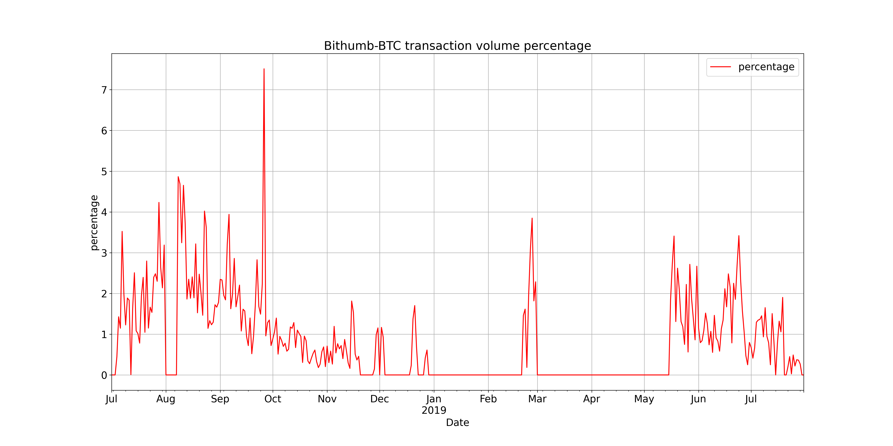

timestamp|closing_Price|Trans(BTC)|upbit_Transaction(KRW)|privateAccount|percentage
-|-|-|-|-|-
2019.7.31|11949000|8040|96069960000 |0|0
2019.7.30|11337000|4770|54077490000 |0|0
2019.7.29|11290000|4960|55998400000 |149563963|0.267086136
2019.7.28|11301000|4660|52662660000 |191553606|0.36373705
2019.7.27|11309000|8270|93525430000 |348527914|0.372655773
2019.7.26|11676000|5530|64568280000 |141934806|0.219821259
2019.7.25|11735000|7070|82966450000 |406208475|0.489605708
2019.7.24|11611000|8790|102061000000 |27963911|0.027399296
2019.7.23|11811000|9190|108543000000 |488115936|0.449697844
2019.7.22|12298000|7620|93710760000 |187777569|0.200379945
2019.7.21|12565000|7500|94237500000 |0|0
2019.7.20|12776000|12760|163022000000 |0|0
2019.7.19|12552000|16960|212882000000 |4049826020|1.902381386
2019.7.18|12651000|30340|383831000000 |4063796404|1.058745334
2019.7.17|11655000|29420|342890000000 |4525843087|1.319910691
2019.7.16|11419000|25500|291185000000 |2249095801|0.77239544
2019.7.15|13186000|23610|311321000000 |0|0
2019.7.14|12433000|18600|231254000000 |1911394902|0.826535565
2019.7.13|13814000|10520|145323000000 |2187511195|1.50527238
2019.7.12|14173000|17830|252705000000 |632463266|0.250277712
2019.7.11|13789000|25450|350930000000 |2766584309|0.788357768
2019.7.10|14610000|29000|423690000000 |4015603964|0.947769351
2019.7.9|14946000|18410|275156000000 |4541821242|1.65063584
2019.7.8|14571000|13220|192629000000 |1799694363|0.934281917
2019.7.7|13660000|6100|83326000000 |1209128188|1.451081521
2019.7.6|13598000|11020|149850000000 |2042531740|1.363051241
2019.7.5|13333000|15600|207995000000 |2798288228|1.345364513
2019.7.4|13542000|17780|240777000000 |3114085625|1.293349751
2019.7.3|14415000|29700|428126000000 |2838720097|0.663057934
2019.7.2|13205000|33650|444348000000 |1833453589|0.412616363
2019.7.1|13005000|25150|327076000000 |2211080634|0.676014848
2019.6.30|13566000|15810|214478000000 |1707515200|0.796124329
2019.6.29|14583000|20520|299243000000 |749431991|0.25044248
2019.6.28|15311000|34250|524402000000 |2474171874|0.47180847
2019.6.27|13994000|53630|750498000000 |7968055298|1.061702091
2019.6.26|15854000|49350|782395000000 |12330481195|1.575992021
2019.6.25|13952000|15990|223092000000 |5204821316|2.333033061
2019.6.24|12891000|8410|108413000000 |3705286034|3.417740897
2019.6.23|12689000|10600|134503000000 |3633328990|2.701291558
2019.6.22|12400000|24080|298592000000 |5541327801|1.855819245
2019.6.21|11982000|10030|120179000000 |2702537276|2.248751389
2019.6.20|11349000|8730|99076770000 |778968197|0.786226879
2019.6.19|11065000|5150|56984750000 |1230138648|2.15871553
2019.6.18|10913000|7160|78137080000 |1938003839|2.480261406
2019.6.17|11046000|8590|94885140000 |1585866932|1.671354368
2019.6.16|10714000|12030|128889000000 |2726371647|2.11527963
2019.6.15|10523000|6510|68504730000 |922770448|1.34701713
2019.6.14|10467000|8250|86352750000 |979378579|1.134160266
2019.6.13|9931000|5730|56904630000 |332237341|0.5838494
2019.6.12|9802000|7050|69104100000 |572296120|0.828165217
2019.6.11|9587000|5510|52824370000 |480522072|0.909659826
2019.6.10|9730000|6740|65580200000 |958811708|1.462044501
2019.6.9|9480000|5370|50907600000 |281912402|0.553772722
2019.6.8|9736000|4770|46440720000 |497025426|1.070236262
2019.6.7|9750000|7870|76732500000 |567419835|0.739477842
2019.6.6|9488000|6690|63474720000 |797793555|1.256868175
2019.6.5|9586000|11680|111964000000 |1699471664|1.517866795
2019.6.4|9496000|13610|129241000000 |1409752251|1.090797077
2019.6.3|9994000|8900|88946600000 |748942710|0.842013871
2019.6.2|10508000|6860|72084880000 |571343820|0.792598698
2019.6.1|10350000|5510|57028500000 |657205161|1.152415303
2019.5.31|10372000|9580|99363760000 |2650605821|2.667578019
2019.5.30|10113000|14080|142391000000 |1226549952|0.861395459
2019.5.29|10325000|8370|86420250000 |1195340080|1.383171282
2019.5.28|10334000|6740|69651160000 |1307520778|1.877241927
2019.5.27|10381000|12060|125195000000 |3396941112|2.713323144
2019.5.26|10300000|11090|114227000000 |643371729|0.563239627
2019.5.25|9582000|4420|42352440000 |940533298|2.220729899
2019.5.24|9583000|8930|85576190000 |641751780|0.749918616
2019.5.23|9488000|9620|91274560000 |1080735193|1.184048647
2019.5.22|9319000|8860|82566340000 |1081994434|1.31045464
2019.5.21|9511000|9780|93017580000 |1936830686|2.082220034
2019.5.20|9583000|11460|109821000000 |2876812533|2.619542545
2019.5.19|9713000|16390|159196000000 |2085980719|1.310321743
2019.5.18|8823000|11610|102435000000 |3491001684|3.408015485
2019.5.17|8891000|22060|196135000000 |5320371673|2.712600604
2019.5.16|9462000|17060|161422000000 |2955497512|1.830916875
2019.5.15|9606000|17860|171563000000 |0|0
2019.5.14|9494000|25060|237920000000 |0|0
2019.5.13|9232000|26610|245664000000 |0|0
2019.5.12|8171000|21050|172000000000 |0|0
2019.5.11|8382000|24010|201252000000 |0|0
2019.5.10|7494000|10600|79436400000 |0|0
2019.5.9|7272000|9560|69520320000 |0|0
2019.5.8|6945000|5630|39100350000 |0|0
2019.5.7|6753000|7370|49769610000 |0|0
2019.5.6|6620000|3960|26215200000 |0|0
2019.5.5|6702000|3200|21446400000 |0|0
2019.5.4|6718000|7000|47026000000 |0|0
2019.5.3|6596000|11090|73149640000 |0|0
2019.5.2|6328000|5230|33095440000 |0|0
2019.5.1|6192000|3940|24396480000 |0|0
2019.4.30|6116000|5330|32598280000 |0|0
2019.4.29|6029000|5700|34365300000 |0|0
2019.4.28|6137000|3980|24425260000 |0|0
2019.4.27|6114000|3100|18953400000 |0|0
2019.4.26|6137000|10590|64990830000 |0|0
2019.4.25|6118000|8240|50412320000 |0|0
2019.4.24|6413000|11840|75929920000 |0|0
2019.4.23|6449000|10860|70036140000 |0|0
2019.4.22|6237000|6660|41538420000 |0|0
2019.4.21|6145000|5970|36685650000 |0|0
2019.4.20|6141000|3990|24502590000 |0|0
2019.4.19|6087000|6350|38652450000 |0|0
2019.4.18|6070000|8490|51534300000 |0|0
2019.4.17|6003000|5950|35717850000 |0|0
2019.4.16|6024000|7500|45180000000 |0|0
2019.4.15|5862000|8100|47482200000 |0|0
2019.4.14|5958000|4220|25142760000 |0|0
2019.4.13|5889000|4230|24910470000 |0|0
2019.4.12|5896000|8430|49703280000 |0|0
2019.4.11|5858000|14340|84003720000 |0|0
2019.4.10|6166000|8320|51301120000 |0|0
2019.4.9|6003000|7550|45322650000 |0|0
2019.4.8|6091000|11260|68584660000 |0|0
2019.4.7|5910000|8600|50826000000 |0|0
2019.4.6|5792000|10080|58383360000 |0|0
2019.4.5|5685000|12730|72370050000 |0|0
2019.4.4|5567000|11970|66636990000 |0|0
2019.4.3|5594000|23010|128718000000 |0|0
2019.4.2|5410000|35770|193516000000 |0|0
2019.4.1|4710000|13060|61512600000 |0|0
2019.3.31|4663000|7660|35718580000 |0|0
2019.3.30|4636000|7110|32961960000 |0|0
2019.3.29|4637000|8580|39785460000 |0|0
2019.3.28|4551000|8950|40731450000 |0|0
2019.3.27|4546000|6800|30912800000 |0|0
2019.3.26|4493000|7150|32124950000 |0|0
2019.3.25|4486000|9560|42886160000 |0|0
2019.3.24|4525000|6140|27783500000 |0|0
2019.3.23|4507000|4010|18073070000 |0|0
2019.3.22|4490000|5770|25907300000 |0|0
2019.3.21|4491000|9060|40688460000 |0|0
2019.3.20|4533000|7160|32456280000 |0|0
2019.3.19|4486000|6630|29742180000 |0|0
2019.3.18|4457000|9500|42341500000 |0|0
2019.3.17|4425000|4050|17921250000 |0|0
2019.3.16|4445000|5140|22847300000 |0|0
2019.3.15|4359000|7100|30948900000 |0|0
2019.3.14|4336000|9700|42059200000 |0|0
2019.3.13|4324000|8250|35673000000 |0|0
2019.3.12|4322000|10290|44473380000 |0|0
2019.3.11|4335000|10950|47468250000 |0|0
2019.3.10|4335000|7250|31428750000 |0|0
2019.3.9|4350000|9810|42673500000 |0|0
2019.3.8|4310000|10010|43143100000 |0|0
2019.3.7|4289000|5120|21959680000 |0|0
2019.3.6|4260000|5280|22492800000 |0|0
2019.3.5|4247000|7840|33296480000 |0|0
2019.3.4|4158000|6150|25571700000 |0|0
2019.3.3|4239000|2860|12123540000 |0|0
2019.3.2|4254000|2990|12719460000 |0|0
2019.3.1|4247000|3230|13717810000 |0|0
2019.2.28|4241000|7140|30280740000 |691862868|2.284828138
2019.2.27|4259000|6560|27939040000 |507716375|1.817229135
2019.2.26|4232000|6240|26407680000 |1016212457|3.848170142
2019.2.25|4255000|7130|30338150000 |932426107|3.073444185
2019.2.24|4177000|10820|45195140000 |876342303|1.939018892
2019.2.23|4478000|4950|22166100000 |41095122|0.185396267
2019.2.22|4351000|4030|17534530000 |283178493|1.614976238
2019.2.21|4328000|7640|33065920000 |483041846|1.460845021
2019.2.20|4315000|5070|21877050000 |0|0
2019.2.19|4259000|9220|39267980000 |0|0
2019.2.18|4235000|9880|41841800000 |0|0
2019.2.17|4043000|6460|26117780000 |0|0
2019.2.16|4005000|4940|19784700000 |0|0
2019.2.15|3986000|4200|16741200000 |0|0
2019.2.14|3984000|2820|11234880000 |0|0
2019.2.13|3983000|3670|14617610000 |0|0
2019.2.12|3981000|3920|15605520000 |0|0
2019.2.11|3985000|3690|14704650000 |0|0
2019.2.10|4023000|4850|19511550000 |0|0
2019.2.9|3998000|4100|16391800000 |0|0
2019.2.8|4009000|8680|34798120000 |0|0
2019.2.7|3783000|4630|17515290000 |0|0
2019.2.6|3791000|4560|17286960000 |0|0
2019.2.5|3835000|3540|13575900000 |0|0
2019.2.4|3822000|2850|10892700000 |0|0
2019.2.3|3821000|2090|7985890000 |0|0
2019.2.2|3855000|2190|8442450000 |0|0
2019.2.1|3816000|3540|13508640000 |0|0
2019.1.31|3775000|5910|22310250000 |0|0
2019.1.30|3810000|7620|29032200000 |0|0
2019.1.29|3795000|4040|15331800000 |0|0
2019.1.28|3828000|5810|22240680000 |0|0
2019.1.27|3951000|2880|11378880000 |0|0
2019.1.26|3963000|3770|14940510000 |0|0
2019.1.25|3957000|4590|18162630000 |0|0
2019.1.24|3983000|4410|17565030000 |0|0
2019.1.23|3996000|4400|17582400000 |0|0
2019.1.22|4013000|6370|25562810000 |0|0
2019.1.21|3976000|4740|18846240000 |0|0
2019.1.20|3982000|4630|18436660000 |0|0
2019.1.19|4115000|4320|17776800000 |0|0
2019.1.18|4046000|4470|18085620000 |0|0
2019.1.17|4078000|5730|23366940000 |0|0
2019.1.16|4052000|5630|22812760000 |0|0
2019.1.15|4035000|4820|19448700000 |0|0
2019.1.14|4098000|4950|20285100000 |0|0
2019.1.13|3963000|3300|13077900000 |0|0
2019.1.12|4097000|3250|13315250000 |0|0
2019.1.11|4105000|5320|21838600000 |0|0
2019.1.10|4087000|10230|41810010000 |0|0
2019.1.9|4460000|4480|19980800000 |0|0
2019.1.8|4480000|5080|22758400000 |0|0
2019.1.7|4499000|4280|19255720000 |0|0
2019.1.6|4520000|4830|21831600000 |0|0
2019.1.5|4294000|3330|14299020000 |0|0
2019.1.4|4309000|5450|23484050000 |0|0
2019.1.3|4283000|4680|20044440000 |0|0
2019.1.2|4347000|5410|23517270000 |0|0
2019.1.1|4284000|3790|16236360000 |0|0
2018.12.31|4201000|4290|18022290000 |0|0
2018.12.30|4286000|4820|20658520000 |0|0
2018.12.29|4193000|5250|22013250000 |0|0
2018.12.28|4338000|9040|39215520000 |239812382|0.611524167
2018.12.27|4123000|6390|26345970000 |110136330|0.418038622
2018.12.26|4292000|7970|34207240000 |0|0
2018.12.25|4243000|8600|36489800000 |0|0
2018.12.24|4540000|11020|50030800000 |0|0
2018.12.23|4437000|7460|33100020000 |0|0
2018.12.22|4470000|7010|31334700000 |217589921|0.69440563
2018.12.21|4332000|16820|72864240000 |1240125904|1.701967802
2018.12.20|4551000|16480|75000480000 |1028405844|1.371199016
2018.12.19|4130000|12330|50922900000 |119590214|0.234845647
2018.12.18|4091000|7660|31337060000 |0|0
2018.12.17|3923000|9100|35699300000 |0|0
2018.12.16|3636000|3540|12871440000 |0|0
2018.12.15|3621000|4030|14592630000 |0|0
2018.12.14|3642000|5890|21451380000 |0|0
2018.12.13|3721000|5310|19758510000 |0|0
2018.12.12|3888000|5660|22006080000 |0|0
2018.12.11|3822000|6670|25492740000 |0|0
2018.12.10|3895000|6040|23525800000 |0|0
2018.12.9|4014000|6480|26010720000 |0|0
2018.12.8|3873000|7670|29705910000 |0|0
2018.12.7|3868000|15550|60147400000 |0|0
2018.12.6|3964000|14120|55971680000 |0|0
2018.12.5|4259000|8320|35434880000 |0|0
2018.12.4|4457000|9750|43455750000 |0|0
2018.12.3|4388000|8890|39009320000 |362239762|0.928597991
2018.12.2|4685000|6980|32701300000 |381481783|1.16656458
2018.12.1|4721000|6990|32999790000 |0|0
2018.11.30|4567000|11390|52018130000 |600320624|1.154060371
2018.11.29|4847000|13590|65870730000 |649246197|0.985636863
2018.11.28|4793000|15130|72518090000 |107203981|0.147830674
2018.11.27|4384000|10020|43927680000 |0|0
2018.11.26|4361000|14660|63932260000 |0|0
2018.11.25|4613000|14840|68456920000 |0|0
2018.11.24|4491000|8850|39745350000 |0|0
2018.11.23|5016000|9160|45946560000 |0|0
2018.11.22|4965000|5000|24825000000 |0|0
2018.11.21|5276000|8520|44951520000 |0|0
2018.11.20|5164000|17980|92848720000 |0|0
2018.11.19|5628000|10150|57124200000 |260780762|0.456515386
2018.11.18|6424000|2330|14967920000 |54934715|0.367016359
2018.11.17|6383000|2850|18191550000 |92974272|0.511084938
2018.11.16|6436000|4920|31665120000 |486003379|1.534822477
2018.11.15|6527000|9340|60962180000 |1105712874|1.813768592
2018.11.14|6779000|9330|63248070000 |102176706|0.161549129
2018.11.13|7248000|2950|21381600000 |63463547|0.296813835
2018.11.12|7249000|2500|18122500000 |107799814|0.594839641
2018.11.11|7253000|1820|13200460000 |114890237|0.870350253
2018.11.10|7237000|1640|11868680000 |47599074|0.401047749
2018.11.9|7243000|3140|22743020000 |163982884|0.721025106
2018.11.8|7289000|3320|24199480000 |155137215|0.641076647
2018.11.7|7308000|4080|29816640000 |228570968|0.766588616
2018.11.6|7231000|3520|25453120000 |137422750|0.539905324
2018.11.5|7198000|2780|20010440000 |238602491|1.192390027
2018.11.4|7214000|2760|19910640000 |53135603|0.266870392
2018.11.3|7150000|1580|11297000000 |66029277|0.584485058
2018.11.2|7179000|2650|19024350000 |57504767|0.302269286
2018.11.1|7188000|1920|13800960000 |97761377|0.708366498
2018.10.31|7162000|2920|20913040000 |42696850|0.204163766
2018.10.30|7140000|2330|16636200000 |114408600|0.687708732
2018.10.29|7098000|3760|26688480000 |152249316|0.570468292
2018.10.28|7257000|1370|9942090000 |26412326|0.265661707
2018.10.27|7285000|1630|11874550000 |21547918|0.181463028
2018.10.26|7275000|2400|17460000000 |57170287|0.327435779
2018.10.25|7272000|2930|21306960000 |130292011|0.611499768
2018.10.24|7293000|3600|26254800000 |138940390|0.529199956
2018.10.23|7269000|3010|21879690000 |89503331|0.40907038
2018.10.22|7295000|2950|21520250000 |59505646|0.276510013
2018.10.21|7311000|1840|13452240000 |46374665|0.344735635
2018.10.20|7302000|1970|14384940000 |121034420|0.841396766
2018.10.19|7291000|2800|20414800000 |194608846|0.953273341
2018.10.18|7338000|2700|19812600000 |60771362|0.306730878
2018.10.17|7328000|3000|21984000000 |207641236|0.944510717
2018.10.16|7352000|3360|24702720000 |251488803|1.018061181
2018.10.15|7406000|11980|88723880000 |975843988|1.099866223
2018.10.14|7198000|2310|16627380000 |111729817|0.671962853
2018.10.13|7184000|1220|8764480000 |112620388|1.284963717
2018.10.12|7181000|4570|32817170000 |375784872|1.145086161
2018.10.11|7196000|7580|54545680000 |642100119|1.177178686
2018.10.10|7472000|4410|32951520000 |208184045|0.631788898
2018.10.9|7527000|2140|16107780000 |93984129|0.583470404
2018.10.8|7542000|3360|25341120000 |197218021|0.778252978
2018.10.7|7484000|1900|14219600000 |99648376|0.70078185
2018.10.6|7482000|2190|16385580000 |138984953|0.848215034
2018.10.5|7502000|3890|29182780000 |276134106|0.946222759
2018.10.4|7475000|3360|25116000000 |128456644|0.511453432
2018.10.3|7377000|3050|22499850000 |313937022|1.395284955
2018.10.2|7370000|3520|25942400000 |275196424|1.06079786
2018.10.1|7375000|4330|31933750000 |283109803|0.886553577
2018.9.30|7393000|3160|23361880000 |168678900|0.722026224
2018.9.29|7358000|3250|23913500000 |322296025|1.347757647
2018.9.28|7409000|5410|40082690000 |514102847|1.282605651
2018.9.27|7447000|4020|29936940000 |287209097|0.959380274
2018.9.26|7310000|750|5482500000 |411854928|7.512173789
2018.9.25|7297000|4130|30136610000 |674575206|2.238391133
2018.9.24|7431000|3040|22590240000 |337076809|1.492134696
2018.9.23|7496000|4220|31633120000 |533003398|1.684953612
2018.9.22|7538000|3270|24649260000 |696614148|2.826105725
2018.9.21|7539000|5330|40182870000 |684738576|1.704055922
2018.9.20|7311000|4570|33411270000 |317607666|0.950600399
2018.9.19|7245000|4300|31153500000 |162286351|0.520924939
2018.9.18|7236000|4050|29305800000 |409459732|1.39719691
2018.9.17|7192000|4530|32579760000 |234743892|0.72052063
2018.9.16|7350000|2940|21609000000 |205359358|0.950341793
2018.9.15|7365000|2210|16276650000 |255300801|1.568509497
2018.9.14|7363000|4350|32029050000 |516641181|1.613039353
2018.9.13|7357000|4030|29648710000 |319710402|1.078328204
2018.9.12|7238000|2240|16213120000 |357415239|2.20448155
2018.9.11|7240000|1550|11222000000 |216045560|1.925196578
2018.9.10|7274000|2050|14911700000 |249389718|1.672443236
2018.9.9|7232000|2240|16199680000 |463168783|2.859123038
2018.9.8|7207000|1890|13621230000 |269717457|1.980125561
2018.9.7|7382000|2790|20595780000 |334665539|1.624922868
2018.9.6|7523000|3630|27308490000 |1075911637|3.93984302
2018.9.5|7695000|3420|26316900000 |845139945|3.21139627
2018.9.4|8270000|2590|21419300000 |394632092|1.84241358
2018.9.3|8118000|3090|25084620000 |490077647|1.953697712
2018.9.2|8115000|3450|27996750000 |652106916|2.329223628
2018.9.1|8001000|4170|33364170000 |782636766|2.345740254
2018.8.31|7872000|4690|36919680000 |656875703|1.779202049
2018.8.30|7850000|4790|37601500000 |625558548|1.663653173
2018.8.29|7825000|4720|36934000000 |636028328|1.722067277
2018.8.28|7839000|4980|39038220000 |505857723|1.295801199
2018.8.27|7685000|4130|31739050000 |391197117|1.232541985
2018.8.26|7547000|2820|21282540000 |283543375|1.33228165
2018.8.25|7604000|3490|26537960000 |303591322|1.14398892
2018.8.24|7561000|1210|9148810000 |331470105|3.623095299
2018.8.23|7439000|1590|11828010000 |475606148|4.021015775
2018.8.22|7286000|5830|42477380000 |622564644|1.46563805
2018.8.21|7375000|3040|22420000000 |451397649|2.013370424
2018.8.20|7266000|4190|30444540000 |752800513|2.472694654
2018.8.19|7431000|2930|21772830000 |332083482|1.525219652
2018.8.18|7391000|4620|34146420000 |1098023754|3.215633598
2018.8.17|7496000|6650|49848400000 |943581976|1.892903235
2018.8.16|7337000|5320|39032840000 |939281952|2.406388959
2018.8.15|7332000|7160|52497120000 |988280854|1.882542993
2018.8.14|7226000|8030|58024780000 |1362632206|2.348362555
2018.8.13|7387000|5710|42179770000 |785597020|1.862497164
2018.8.12|7391000|2680|19807880000 |733328248|3.702204618
2018.8.11|7326000|5060|37069560000 |1724840190|4.652982636
2018.8.10|7240000|5770|41774800000 |1355574650|3.244957845
2018.8.9|7543000|6340|47822620000 |2241952512|4.68805873
2018.8.8|7308000|7970|58244760000 |2833401816|4.864646736
2018.8.7|7763000|5910|45879330000 |0|0
2018.8.6|7982000|3800|30331600000 |0|0
2018.8.5|8075000|3580|28908500000 |0|0
2018.8.4|8074000|5210|42065540000 |0|0
2018.8.3|8509000|6140|52245260000 |0|0
2018.8.2|8723000|6310|55042130000 |0|0
2018.8.1|8726000|6030|52617780000 |0|0
2018.7.31|8807000|8920|78558440000 |2503591346|3.186915812
2018.7.30|9270000|5490|50892300000 |1087828880|2.137511726
2018.7.29|9240000|4120|38068800000 |1006503128|2.643905581
2018.7.28|9204000|3910|35987640000 |1523372808|4.233044479
2018.7.27|9142000|10050|91877100000 |2112321100|2.299072457
2018.7.26|8952000|7710|69019920000 |1713346868|2.482394746
2018.7.25|9155000|11240|102902000000 |2464506839|2.395003828
2018.7.24|9458000|16480|155868000000 |2394063435|1.535955703
2018.7.23|8749000|9850|86177650000 |1433348022|1.663247979
2018.7.22|8350000|3850|32147500000 |369606074|1.149719493
2018.7.21|8353000|3410|28483730000 |796197483|2.795271135
2018.7.20|8359000|7480|62525320000 |655131517|1.047785948
2018.7.19|8443000|6090|51417870000 |1230770520|2.393662981
2018.7.18|8303000|9230|76636690000 |1485233109|1.938018342
2018.7.17|8076000|8860|71553360000 |559406793|0.781803668
2018.7.16|7454000|6210|46289340000 |469320620|1.013884881
2018.7.15|7178000|2380|17083640000 |185195401|1.08405118
2018.7.14|7111000|1980|14079780000 |353036303|2.507399285
2018.7.13|7054000|3730|26311420000 |428941750|1.630249337
2018.7.12|7090000|3720|26374800000 |2164940|0.008208366
2018.7.11|7226000|3910|28253660000 |518283700|1.834394907
2018.7.10|7140000|5200|37128000000 |700776569|1.887461132
2018.7.9|7473000|3710|27724830000 |340418331|1.227846414
2018.7.8|7516000|2800|21044800000 |417586632|1.984274652
2018.7.7|7549000|2080|15701920000 |553048741|3.522172709
2018.7.6|7479000|5350|40012650000 |459024227|1.147197766
2018.7.5|7360000|4270|31427200000 |448372720|1.426702729
2018.7.4|7329000|4980|36498420000 |163212052|0.447175664
2018.7.3|7283000|5240|38162920000 |206506|0.000541117
2018.7.2|7287000|5930|43211910000 |182828|0.000423096
2018.7.1|7103000|3150|22374450000 |0|0

