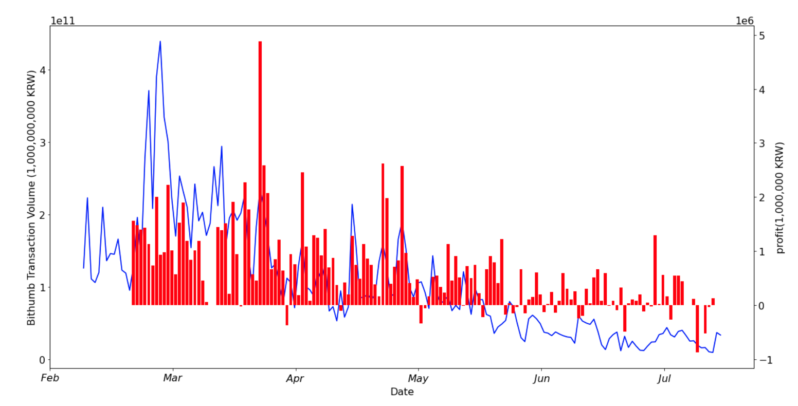

# BTC_KRW_Data.csv 파일

- 2018.02.01 ~ 07.17 Bithumb BTC 거래 데이터 입니다.
- endingPrice column은 거래소 종가 입니다. (KRW)
- percentage는 계좌 거래량 / 거래소 총 거래량 비율 입니다. (%)
- profit은 일 별 amount의 sum 입니다. (KRW)
- Bithumb_Trans_Vol column은 일 별 거래소 총 거래량입니다. (KRW)
- 주의해야 할 점은 0-0 profit은 정확히 일 별 수익이 아니라 당 일에 있던 0이 되는 지점들의 수익들을 모두 합한 값 입니다.

 

# BTC_KRW_Data_Summary.csv 파일

- BTC_KRW_Data.csv 파일의 데이터를 달 별로 합쳐 요약한 테이블 입니다.
- Gap은 sum of amount 로 계산한 profit과 0 to 0으로 계산한 profit의 차 입니다.
- 3.1 ~ 3.5만 제외 하면 대체적으로 비슷합니다

 

# 지난번의 3월 amount 전부 더했을 때는 3,562,946원, 0되는 포인트 잡아서 했을 때 12,136,502원 나오는 문제에 대하여

- 3월 6일 7일 거래가 0이라 8일 이후로 계산이 반영되지 않았음
- 즉, 3,562,946원은 3월 1일 ~ 5일의 거래 수익
- 뒤의 것을 모두 계산해 주면 0되는 포인트 잡아서 계산 했을 때 총 3월 수익 : 33,992,517
- 3월 1일 ~ 5일이 두 방식이 매우 많이 차이남 (-17,116,828(sum of amount) vs 3,562,946)
- 7월 이후는 왜 0이 되는 지점이 나오지 않을까..? 끊임 없이 바닥으로 고꾸라진 것인가?

 

# ending price - percentage graph

 

# ending price - profit(sum of amount) graph

 

.png)

 

- 일 별 종가 - 수익(sum of amount) 그래프 입니다.

# ending price - profit(0 to 0) graph

 

.png)

- 두 가지 profit의 max 값 단위가 다르다. 무려 10배 차이남 (39,752,051 vs 4,881,213)

 

# transaction volume - profit(sum of amount) graph

 

.png)

 

# transaction volume - profit(0 to 0) graph

 

.png)

 

# transaction volume - profit(0 to 0) bar version graph

 

 