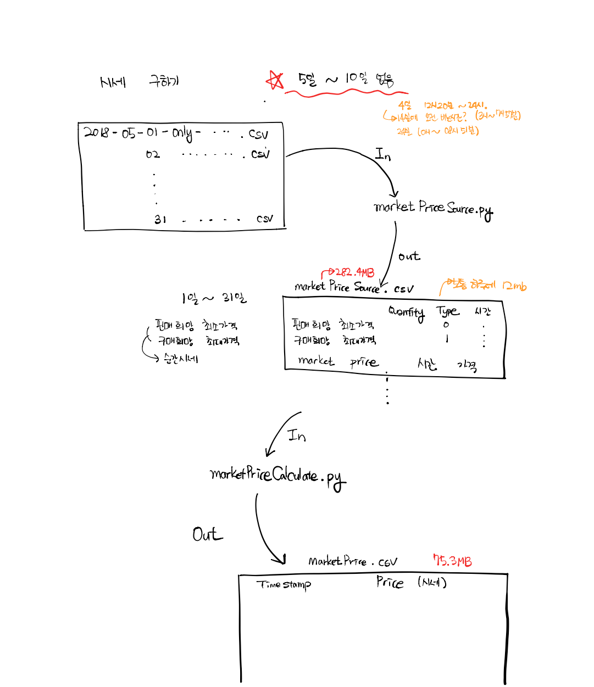

## jupyter notebook  in terminal
# python version = python 3.7

## package
# pandas
# numpy
# matplotlib
# seaboarn

2020.04.10
+ table 과 data 제외 upload
+ 시세 그래프 그리기 - python으로 필요한 row만 추출 후 jupyter notebook으로 그래프 그릴 예정
+ Issue : python csv library가 100MB가 넘는 csv 파일을 효과적으로 처리 할 수 있을 것인가? 아니면 다른 방법이 있을까?

____________________
2020.04.15
+ Minute - Transaction (Total, Sell, Buy) table 및 graph 완성.
+ Hour - Transaction (Total, Sell, Buy) table 및 graph 완성.
+ Date - Transaction (Total, Sell, Buy) table 및 graph 완성.
+ Minute, Hour, Date - MarketPrice graph 완성.

